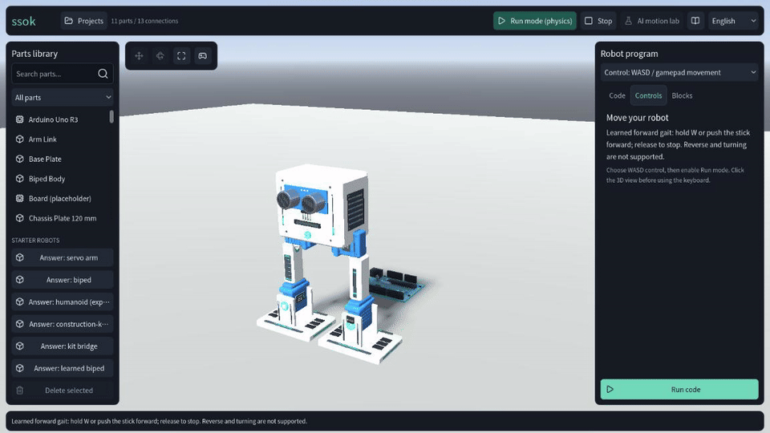
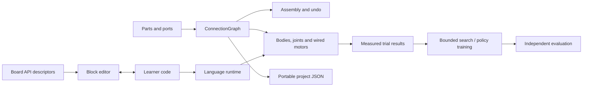

# ssok · 쏙

**Build a robot. Wire its motors. Make it move.**

ssok is an educational 3D robotics workshop built with Godot. Snap individual parts together,
inspect the wiring, write a small servo program or assemble it from blocks, then test the same
robot under gravity. Save a project, share it, and take it apart to understand how it works.

English · 한국어 · 简体中文 · 日本語

[Open the browser workshop](https://bum-boo.github.io/ssok/) · [Download v0.2.0](https://github.com/Bum-Boo/ssok/releases/tag/v0.2.0) · [Developer start](docs/START_HERE.md)


> The first playable path is the servo-arm flag mission, followed by three measured learning stages.
> Learned locomotion and construction-kit experiments remain research exhibits with recorded limitations.

## Try the workshop

Desktop packages include the engine. Windows offers a setup installer or portable ZIP;
macOS offers an Intel/Apple Silicon `ssok.app` ZIP; Linux offers an executable/PCK ZIP.
See [installation and platform validation](docs/BUILD.md). Developer ID notarization and
publisher signing are not configured. macOS has not yet been exercised on a physical Mac.
See the [publication record](docs/evidence/public_release_2026-09-30/README.md) for the exact source, hashes and checks.

For development, with **Godot 4.7.2** installed:

```sh
git clone https://github.com/Bum-Boo/ssok.git
cd ssok
godot --headless --path . --import --quit
godot --path .
```

1. Choose **Try the flag mission** and load the servo arm, or assemble and wire one yourself.
2. Choose **Run code**. The flag follows the real servo arm; the goal uses its observed height. **Build this arm yourself** starts assembly and wiring practice.
3. Return to edit mode. **Blocks** opens first; change an angle, apply it to code, and try again. Code and free assembly remain available.
4. Open **Projects** to save a snapshot. Reopen it later, or export its JSON to another device.
5. Open **Stages** for the flag, finish-line car or sonar braking challenge, or **Free building · Lab** to create and export your own verified challenge.
6. The **construction-kit humanoid** and its **AI motion lab** remain available as research exhibits.

No account, API key or paid model is needed for local assembly, coding, physics, storage or
pickup experiments. Optional external AI services keep their keys outside the application.

[Flag mission and reused components](docs/FLAG_MISSION.md) · [Controls](docs/CONTROLS.md) · [Interface preferences](docs/INTERFACE_PREFERENCES.md) · [Projects and blocks](docs/AUTHORING.md) ·
[Stages, motors, sonar and bounded learner language](docs/LEARNING_STAGES.md) · [App control API design](docs/APP_CONTROL_API.md) ·
[Build and verify](docs/BUILD.md) · [Engineering case study](docs/ENGINEERING.md)

The selected feedback policy passes six declared browser start/restart flows in an isolated export
with recorded source hashes. [The current validation report](docs/evidence/heading_feedback_2026-09-22/README.md)
retains the selection process and the remaining failure. The preceding integrated `389f817` checkpoint
passes 59 native checks, clean Web/Linux builds and all three browser gates. The new policy
policy is preserved as a research exhibit. Current publication does not claim universal locomotion.
Earlier recordings used the old per-pass motor implementation; current code uses the corrected whole-step torque budget ([ADR 0020](docs/adr/0020-whole-step-actuator-torque-budget.md)).

## Watch a real physics trial


This recording uses the corrected motor budget and a four-second lift. It raises the box
**47.7 cm** and holds it for **1 second**, after bilateral contact activates the grasp constraints.
The robot is assembled from the same individual
parts available in the workshop. The final result stays on screen after evaluation; that pause
does not count toward the measured hold.

[1152 × 648 recording](docs/media/pickup.webm) · [Measurements](docs/evidence/corrected_recordings_2026-09-22/pickup.json) ·
[Reproduce the capture](docs/media/PICKUP.md)

## Watch learned forward walking



The current selected feedback policy runs under the corrected **0.25 N·m** cap. In this
recorded episode, holding W for **12 seconds** moves the robot **42.1 cm** forward; releasing W
leaves it standing. The camera follows its horizontal travel while preserving the editing view.

[1152 × 648 recording](docs/media/learned-walk.mp4) · [Full-size still](docs/media/learned-walk.png) ·
[Measurements](docs/evidence/heading_recording_2026-09-22/learned.json) · [Reproduce the capture](docs/media/LEARNED_WALK.md)

## What you can explore

| Workflow | What actually happens |
|---|---|
| Build from reusable parts | The construction catalog offers 25 reusable products, including beams, plates, motors and fasteners. The pickup humanoid has 181 robot parts; the bridge has 29. Holes are real attachment ports, and each part remains editable. |
| Edit and inspect | Search parts, select, move and rotate with Blender-style controls, constrain axes, cancel or undo. Connections and transforms stay in one graph. |
| Program a wired robot | A bounded Python-style servo language and profile-derived block controls address the motors connected in the wiring graph. This is a teaching language, not a full Python or Arduino firmware emulator. |
| Keep and share your work | Versioned JSON snapshots preserve the assembly and learner source. Invalid imports leave the open project untouched; loading never executes code. |
| Observe physical experiments | Gravity, contacts and bounded motor torques determine pickup results. Independent trial worlds retain their measured successes and failures. |
| Inspect learning research | Reproduce MuJoCo policy training and Godot evaluation. Results, held-out seeds and transfer failures are included alongside the code. |

The original virtual construction standard is **not a certified hardware kit**. The simulator
does not establish that a learned or hand-written controller is safe on a real robot.

## Engineering at a glance



- **One assembly authority:** editor, physics, wiring, persistence and learning derive from `ConnectionGraph`.
- **Web and desktop:** GDScript, GL Compatibility and a single-threaded Web export share the same application.
- **Measured behavior:** a contact-gated gripper cannot succeed by moving the box in code or disabling gravity.
- **Explicit ownership:** learner code, manual movement and experiments cannot command a robot simultaneously.
- **Reproducible checks:** isolated data directories, a mock HTTP/MCP bridge, pinned toolchains, retained failure logs and exported-resource audits.

[Architecture](docs/ARCHITECTURE.md) · [Decision records](docs/adr/) ·
[Pickup evidence](docs/CONSTRUCTION_KIT.md) · [RL methods and results](docs/RL_LAB.md)

[한국어 기술노트 (2026-09-30)](docs/TECHNICAL_NOTE_2026-09-30.md) records the implemented workflows, physical evidence, UX research, reused components, AI connection boundaries and the current learning roadmap.

## Current measured limits

The corrected elementary-kit pickup passes the original 25 cm / 1 second gate, including
perturbed box positions and reversed graph ordering. Its four-second lift passes 277 physical
assertions and twelve pickup integration suites, reaching about 47.7 cm. Stable continuous
walking with the articulated construction kit remains unfinished. The four-servo manual biped
also has unresolved failures during continuous direction changes; isolated direction checks do
not establish reliable continuous control. Legacy humanoid walking,
backward movement, pickup and running have focused corrected-model passes; the older 14/14
running matrix remains historical until repeated in full.

The current yaw-hip policy combines a learned periodic gait with learned lateral/heading feedback.
Its heading coefficient was selected from an earlier learned policy while retaining the corrected-model
position/velocity feedback. This is post-training coefficient selection, not another training run.
Frozen before a new paired evaluation, it passes **255/256 conditions with one fall**; the previous
bundle passes **251/256 with five falls** on those same conditions. Five failures improve and one
previously successful condition regresses. Twelve actual native-app flows and six Chromium
WebAssembly flows pass separately; browser travel is 41.59–43.16 cm in 12 seconds.

These results concern one simulated robot, ±0.004 m/s initial velocity noise, 0–5-second start
delays and declared restart intervals. They do not guarantee every restart or arbitrary assemblies.
MuJoCo's independently trained policy still fails Godot transfer; its evidence is retained.
[Methods and complete outcomes](docs/evidence/heading_feedback_2026-09-22/README.md) distinguish
training, component selection, frozen evaluation and browser checks. Clean integrated verification,
public release, continuous manual control and kit locomotion remain unfinished.

## Development

New contributors and AI sessions: [start here](docs/START_HERE.md) for task-specific reading,
[current direction and source baseline](docs/STATUS.md), [file map](docs/generated/CODE_MAP.md),
[data relationships](docs/DATA_MODEL.md), [execution flows](docs/FLOWS.md) and
[documentation maintenance](docs/MAINTENANCE.md). These are separate from dated experiment history.

```sh
python3 tools/ci/install_godot.py --templates
python3 -m venv build/venv
build/venv/bin/python -m pip install -r tools/ci/requirements-lock.txt
build/venv/bin/python tools/ci/verify.py --godot "$PWD/build/toolchain/godot"
build/venv/bin/python tools/ci/build.py --godot "$PWD/build/toolchain/godot" --version preview
```

The full procedure, browser checks and artifact layout are in [BUILD.md](docs/BUILD.md).
Contributors should read [AGENTS.md](AGENTS.md) and existing decisions before changing the architecture.
UI changes include English, Korean, Simplified Chinese and Japanese together.

Original work is by **Bum-Boo**, with AI-assisted implementation and verification documented through
the repository's changes and decisions. Original project rights are retained; third-party engine,
font and icon licenses are listed in [THIRD_PARTY_NOTICES.md](THIRD_PARTY_NOTICES.md).
