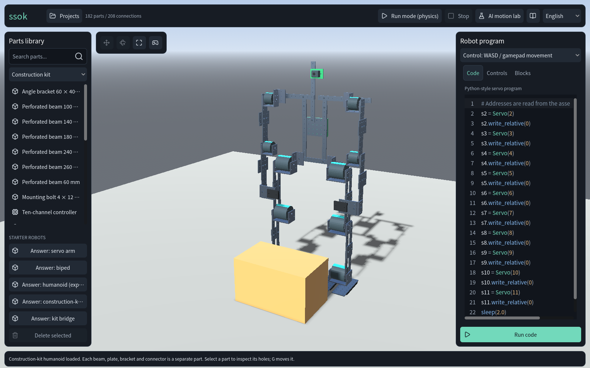
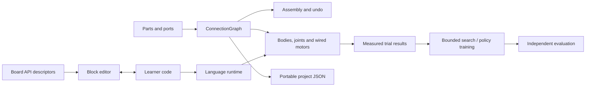

# ssok · 쏙

**Build a robot. Wire its motors. Make it move.**

ssok is an educational 3D robotics workshop built with Godot. Snap individual parts together,
inspect the wiring, write a small servo program or assemble it from blocks, then test the same
robot under gravity. Save a project, share it, and take it apart to understand how it works.

English · 한국어 · 简体中文 · 日本語



> Release preparation is in progress. Browser and Linux builds run locally; public release
> remains gated on the [verification and delivery checklist](docs/RELEASE_PLAN.md).
> Learned locomotion is an active experiment, with measured results rather than a claim of universal robotics AI.

## Try the workshop

With **Godot 4.7.2** installed:

```sh
git clone https://github.com/Bum-Boo/ssok.git
cd ssok
godot --headless --path . --import --quit
godot --path .
```

1. Load **Answer: servo arm** from the parts library. Short windows use **Load an example**.
2. Choose **Run code**. The program controls the servo connected to its actual board pin.
3. Return to edit mode. Try **Blocks**, change an angle, apply it to code and run again.
4. Open **Projects** to save a snapshot. Reopen it later, or export its JSON to another device.
5. Try the **construction-kit humanoid** and its **AI motion lab** for observable pickup trials.

No account, API key or paid model is needed for local assembly, coding, physics, storage or
pickup experiments. Optional external AI services keep their keys outside the application.

[Controls](docs/CONTROLS.md) · [Projects and blocks](docs/AUTHORING.md) ·
[Build and verify](docs/BUILD.md) · [Engineering case study](docs/ENGINEERING.md)

## Watch a real physics trial


This recorded trial lifts the box **47.7 cm** and holds it for **1 second** using bounded joint
motors and contact-triggered grasp constraints. The robot is assembled from the same individual
parts available in the workshop. The final result stays on screen after evaluation; that pause
does not count toward the measured hold.

[720p recording](docs/media/pickup.webm) · [Measurements](docs/evidence/pickup-video.json) ·
[Reproduce the capture](docs/media/PICKUP.md)

## What you can explore

| Workflow | What actually happens |
|---|---|
| Build from reusable parts | 24 elementary construction products form a 181-part humanoid or a 29-part bridge. Holes are real attachment ports; bolts, beams and plates remain individually editable. |
| Edit and inspect | Search parts, select, move and rotate with Blender-style controls, constrain axes, cancel or undo. Connections and transforms stay in one graph. |
| Program a wired robot | A bounded Python-style servo language and profile-derived block controls address the motors connected in the wiring graph. This is a teaching language, not a full Python or Arduino firmware emulator. |
| Keep and share your work | Versioned JSON snapshots preserve the assembly and learner source. Invalid imports leave the open project untouched; loading never executes code. |
| Observe physical experiments | Gravity, contacts and bounded motor torques determine pickup results. Independent trial worlds retain their measured successes and failures. |
| Inspect learning research | Reproduce MuJoCo policy training and Godot evaluation. Results, held-out seeds and transfer failures are included alongside the code. |

The original virtual construction standard is **not a certified hardware kit**. The simulator
does not establish that a learned or hand-written controller is safe on a real robot.

## Engineering at a glance



- **One assembly authority:** editor, physics, wiring, persistence and learning derive from `ConnectionGraph`.
- **Web and desktop:** GDScript, GL Compatibility and a single-threaded Web export share the same application.
- **Measured behavior:** a contact-gated gripper cannot succeed by moving the box in code or disabling gravity.
- **Explicit ownership:** learner code, manual movement and experiments cannot command a robot simultaneously.
- **Reproducible checks:** isolated data directories, a mock HTTP/MCP bridge, pinned toolchains, retained failure logs and exported-resource audits.

[Architecture](docs/ARCHITECTURE.md) · [Decision records](docs/adr/) ·
[Pickup evidence](docs/CONSTRUCTION_KIT.md) · [RL methods and results](docs/RL_LAB.md)

## Current measured limits

The elementary-kit pickup now clears the original 25 cm / 1 second gate, including perturbed
box positions and reversed graph ordering. The legacy humanoid now passes its flight and uprightness
gates across 14 start/order variants, but can drift sideways by up to 0.87 m; it is a running
experiment with limited directional control. Final clean-revision CI remains required.
MuJoCo learning has improved on held-out seeds, but its policy has **not** passed the Godot
transfer gate. A separate yaw-hip robot trained directly in Godot now succeeds on **31 of 32
held-out trials**, with no falls and 42.2 cm mean forward travel in 12 seconds. Each episode
starts a fresh native Linux engine process; failed trials remain in the evidence. Five actual-app
start/restart checks pass, but rapid restarts and WebAssembly locomotion remain under review.
These measurements cover one robot, small initial-velocity perturbations and 0–3 second start delays.
See the linked evidence for
exact conditions, measured values and reproducible commands.

## Development

```sh
python3 tools/ci/install_godot.py --templates
python3 -m venv build/venv
build/venv/bin/python -m pip install -r tools/ci/requirements-lock.txt
build/venv/bin/python tools/ci/verify.py --godot "$PWD/build/toolchain/godot"
build/venv/bin/python tools/ci/build.py --godot "$PWD/build/toolchain/godot" --version preview
```

The full procedure, browser checks and artifact layout are in [BUILD.md](docs/BUILD.md).
Contributors should read [AGENTS.md](AGENTS.md) and existing decisions before changing the architecture.
UI changes include English, Korean, Simplified Chinese and Japanese together.

Original work is by **Bum-Boo**, with AI-assisted implementation and verification documented through
the repository's changes and decisions. Original project rights are retained; third-party engine,
font and icon licenses are listed in [THIRD_PARTY_NOTICES.md](THIRD_PARTY_NOTICES.md).
