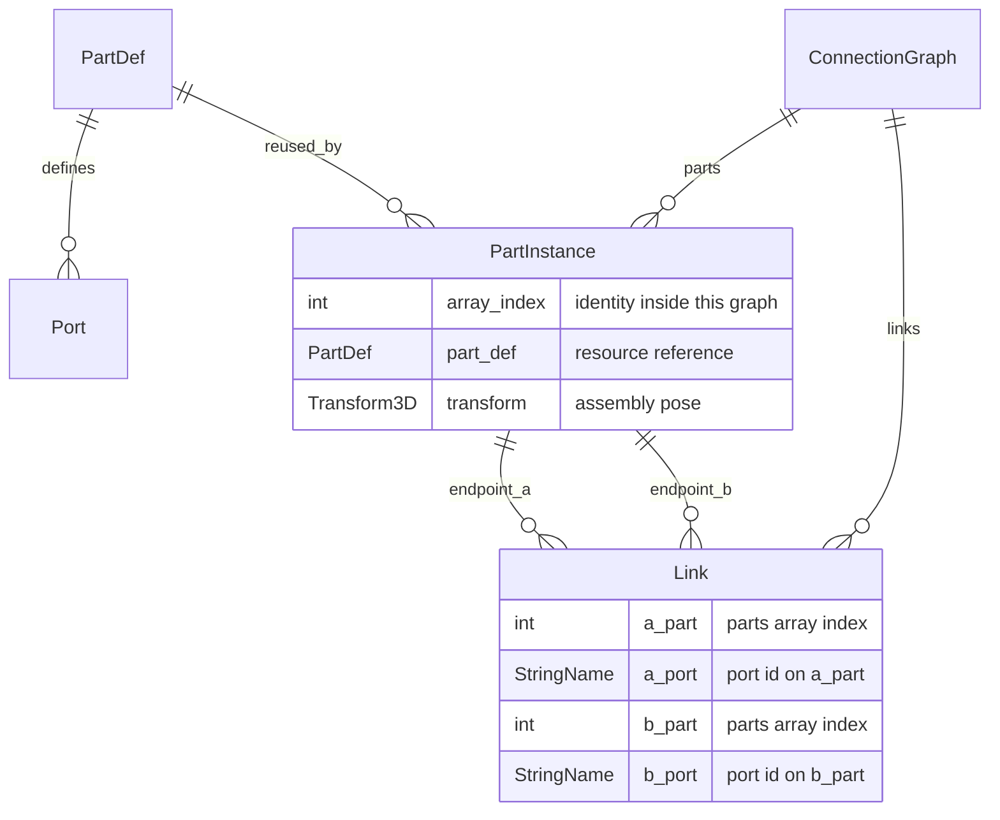
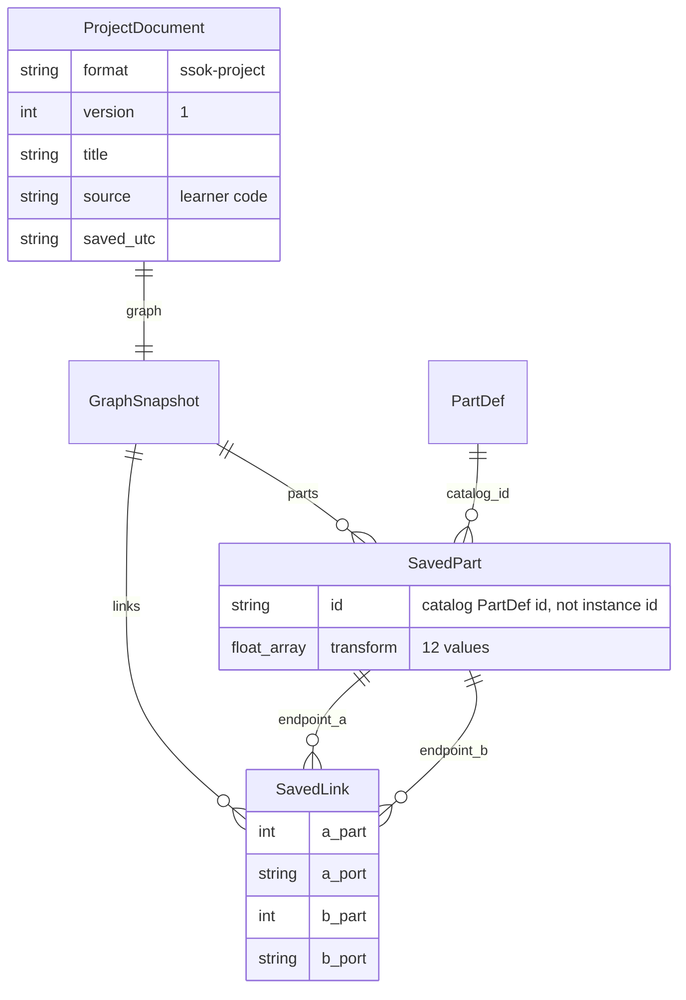

# 데이터 관계와 저장 계약

기준: [STATUS](STATUS.md)의 통합 소스. 아래는 현재 Godot 리소스와 JSON의 논리 관계예요. 서버 관계형 DB를 구현했다는 뜻은 아니에요. `PartInstance`, `Link`, `ProjectDocument`, `GraphSnapshot`은 설명용 이름이며 실제 `class_name`이 있는 클래스는 아니에요.

## 현재 논리 ERD



## 저장 JSON의 관계

같은 카탈로그를 아래 JSON에서 ID로 참조해요. 런타임 리소스 참조와 저장 데이터를 나눠 표시해요.



Link의 각 끝점은 **부품 배열 인덱스 + 그 정의의 포트 ID**로 식별해요. 포트 하나는 최대 한 링크에 참여하고 양쪽 kind와 tag/accepts가 호환돼야 해요. 삭제 시 인덱스를 재정렬하므로 현재 배열 인덱스를 향후 커뮤니티의 영구 객체 ID로 사용하지 않아요. ERD의 SavedLink는 Link와 같은 네 필드를 JSON 숫자/문자열로 저장해요.

## 데이터의 정본과 파생값

| 소유자 | 보유하는 것 | 경계 |
|---|---|---|
| `PartDef` / `Port` | 카탈로그 부품, 질량, 메쉬, 포트와 관절 속성 | 프로젝트는 리소스 경로 대신 카탈로그 ID를 참조 |
| `ConnectionGraph` | 배치된 `parts`와 `links` | 편집 조립의 정본. 물리 결과로 자동 덮어쓰지 않음 |
| `AssemblyMode` | 그래프와 편집 노드, Undo/Redo 스냅샷 | 같은 조립을 편집하고 전기 연결은 위치 보존 |
| `RunMode` | 파생 강체, 관절, 그래프 배선의 서보·DC 모터·초음파 매핑 | teardown으로 제거. 물리 노드는 저장하지 않음 |
| `BoardProfile` | ID, 명령/인자 API, 핀 상수와 sleep 단위 | 인터프리터를 포함하지 않음 |
| `LearnerProgram` / `BlockProgramPanel` | 지원 코드의 명령 표현과 미적용 초안 | 학습자 source와 충돌하면 양쪽 보존 |
| `ProjectStore` / `MotionSnapshot` | JSON 계약과 검증 | 불러오기에서 자동 코드 실행 금지 |

## 프로젝트 v1의 실제 모양

```text
{ format: "ssok-project", version: 1, title, source, saved_utc,
  graph: { version: 1,
           parts: [{ id: <catalog-id>, transform: [<12 numbers>] }],
           links: [{ a_part, a_port, b_part, b_port }] } }
```

`transform`은 basis.x, basis.y, basis.z, origin 순서의 XYZ예요. 유한값, 회전 강체 basis와 좌표 범위를 검사해요. 프로젝트는 빈 그래프도 허용하지만 독립 물리 실험용 MotionSnapshot은 비어 있는 조립을 거부해요.

현재 한도는 프로젝트 JSON 512 KiB, source 64 KiB, 제목 80자, 저장 파일 128개, 부품 256개, 링크 1024개, 각 좌표 절댓값 100m예요. 디스크 파일 ID는 24자리 소문자 hex이며 JSON 내부의 학습자 객체 ID가 아니에요. 정확한 한도와 거부 정책은 아래 소스를 따르고 변경 때 이 설명도 검토해요.

`ProjectStore.save()`는 새 ID의 `.tmp` 파일을 쓴 뒤 rename해 독립 스냅샷을 만들어요. 기존 파일을 수정하는 자동 저장, 클라우드 병합과 미저장 작업 복구는 현재 계약에 없어요. Stage는 아래 별도 문서 형식으로 프로젝트 v1을 포함해요. 프로젝트 v1의 exact-key에 Stage 필드를 덧붙이지 않아요.

## Stage v2의 관계와 실행 증거

`ssok-stage` v2는 `id`, `title`, `scene`, `author_solution`, `rules`, `constraints`를 가져요. `scene`과 `author_solution`은 각각 프로젝트 v1 문서예요. v1 Stage도 읽으며 v2로 생성해요. 규칙은 metric, part_id, min/max, hold_seconds와 target_index를 포함해요. `target_index = -1`은 일치하는 종류가 정확히 하나일 때만 허용해요. 직접 선택한 인덱스는 로딩 시 그래프 인스턴스 토큰에 묶이며 삭제·대체하면 재선택이 필요해요. 이 토큰은 저장하는 영구 객체 ID가 아니에요.

기본 스테이지는 `StageLevels` 항목이 레벨 씬 경로와 `StageCatalog` 정의를 묶어요. 레벨 씬의 바닥·소품·목표 표시는 그래프가 아니며 충돌하는 과제 물체(`stage_wall`)만 그래프 부품이에요. 레벨 씬(`res://stages/`)도 실행 문맥의 자원 해시에 들어가요. 스테이지 성공 기록은 `user://progress.json`(`ssok-progress` v1, `cleared` 사전)에 따로 저장하며 프로젝트·설정과 섞지 않아요. 가져온 과제 파일에는 레벨 참조가 없어서 기본 바닥에서 열려요.

판정은 `StageEvaluator`가 실제 물리를 관측해요. 성공 증거는 과제 전체, 그래프/소스, 엔진·런타임·모델, 보드 API/시간 단위, 물리 설정, 센서 조건의 fingerprint에 묶여요. 파일에 신뢰할 인증서를 담지 않으며 가져온 과제는 다시 성공해야 해요. [Stage 계약](STAGE_CONTRACTS.md)과 [ADR 0025](adr/0025-stage-targets-proofs-and-outcomes.md)를 따라요.

보드 profile은 현재 그래프에서 파생하며 저장 문서에 별도 중복 필드를 넣지 않아요. 미적용 블록은 독립 초안으로 보존하고 과제 출제·내보내기에서 적용을 요구해요. 외관 색·데칼과 클라우드 진행 기록은 이 스키마에 없어요.

## 근거와 확장 지점

- [ConnectionGraph](../src/core/connection_graph.gd), [PartDef](../src/core/part_def.gd), [Port](../src/core/port.gd)
- [ProjectStore](../src/core/project_store.gd), [MotionSnapshot](../src/runtime/motion_snapshot.gd)
- [저작 검증](../tests/project_store_check.gd), [실행 흐름](FLOWS.md), [ADR 0002](adr/0002-connection-graph-single-source-of-truth.md), [ADR 0022](adr/0022-electrical-links-preserve-placement.md)

커뮤니티 ERD는 계정·권한·버전·리믹스 정책이 확정될 때 별도 문서로 추가해요. 현재 저장 계약의 ERD에 미구현 테이블을 섞지 않아요.

## 로컬 인터페이스 선호도

`Preferences` autoload는 `user://interface.cfg`의 `[interface]` 키 `appearance`, `text_scale`, `code_scale`, `muted`, `volume`을 검증해요. 언어는 기존 `language.cfg`에 유지해요. 그래프/프로젝트/Stage JSON에는 개인 선호를 넣지 않아요. 기본값·타입·한도·실패 계약은 [설정 문서](INTERFACE_PREFERENCES.md)를 따르세요.
