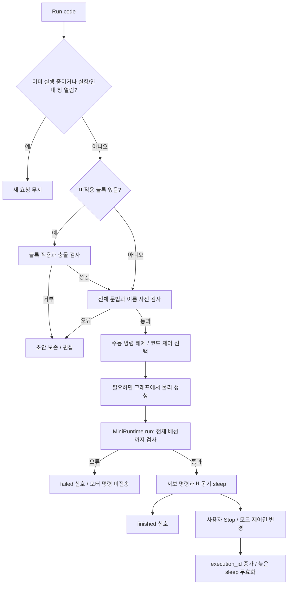
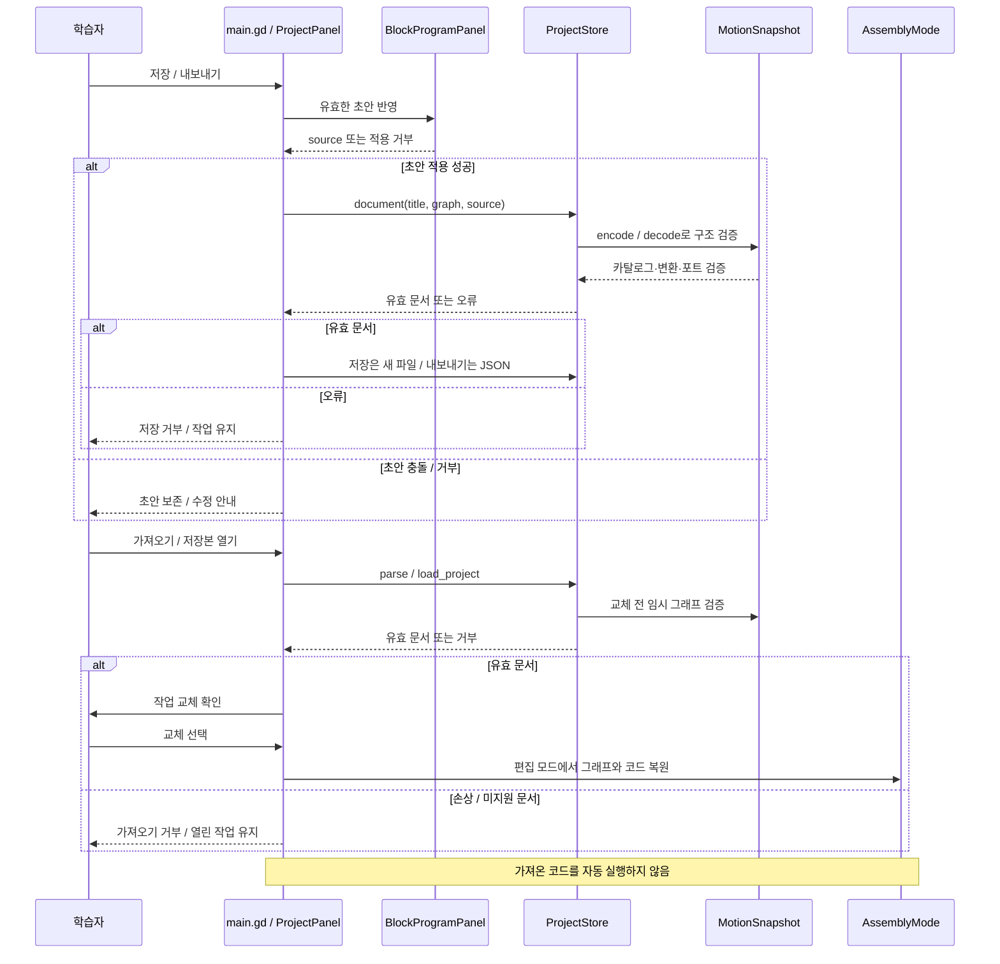
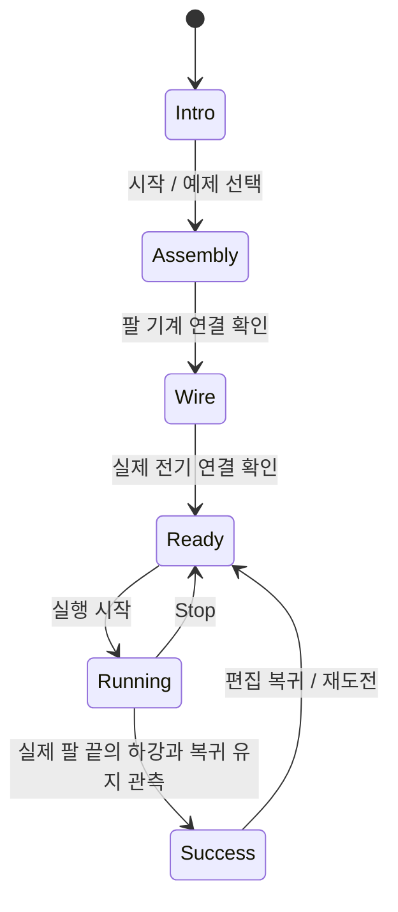
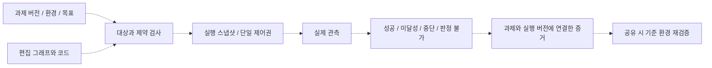

# 실행과 저장 흐름

실선으로 표현한 아래 세 도식은 [STATUS](STATUS.md)의 기준 코드예요. 마지막 도식은 후속 설계이며 현재 앱의 전체 상태 머신으로 사용하지 않아요.

## 코드 실행과 제어권

`scenes/main.gd`가 실행 버튼과 제어권을 조정하고 `MiniRuntime`이 명령을 해석해요. 코드 종료와 임무 성공은 다른 사건이에요. 현재 Stop은 명령을 중단하고 서보의 마지막 목표를 유지해요. 물리 정지나 초기 자세 복원으로 해석하지 않아요. 편집 모드 복귀는 `RunMode.teardown()` 뒤 원본 그래프를 다시 보여줘요.

## 저장과 가져오기

각 화살표는 책임 간 논리 호출을 요약해요. 거부 경로에서는 이후 저장/교체 호출을 하지 않아요. 저장 중인 그래프는 편집 원본이며 현재 강체 위치가 아니에요.

## 깃발 임무

이것은 대표 경로예요. 그래프를 관찰해 기계 연결이 없어지면 Assembly, 배선이 없어지면 Wire로 돌아가는 경로가 모든 관련 상태에 추가돼요. 실제 전이는 [FlagMission._build_chart](../src/ui/flag_mission.gd), 실제 판정은 `_observed_flag_raised()`를 확인해요. 정확한 높이·유지 조건은 [FLAG_MISSION](FLAG_MISSION.md)에 있어요. 깃발 완료가 학습 효과나 다른 로봇의 성공을 인증하지 않아요.

## 후속 Stage와 공유 설계

점선은 추가할 계약이에요. `issues-31-36` 작업의 부분 구현은 통합 후 다시 대조해요. 대상 객체 ID, 환경과 로봇의 경계, 실행 중 변경 방지, 취소 뒤 늦은 응답, 시스템 오류의 판정 제외를 명세해야 해요. 과제/환경 변경으로 기존 성공 인증이 유효한지 결정하고 저장 버전 이행과 함께 기록해요.

## 소스와 확인할 검사

[main.gd](../scenes/main.gd), [MiniRuntime](../src/runtime/mini_runtime.gd), [RunMode](../src/runtime/run_mode.gd), [BlockProgramPanel](../src/ui/block_program_panel.gd), [ProjectPanel](../src/ui/project_panel.gd), [FlagMission](../src/ui/flag_mission.gd)가 근거예요. 검사는 [core_authoring](../tests/core_authoring_check.gd), [control_flow](../tests/control_flow_check.gd), [flag_mission](../tests/flag_mission_check.gd)를 작업 범위에 맞춰 실행해요. 이 문서 작성으로 앱 검사를 새로 통과한 것은 아니에요.
