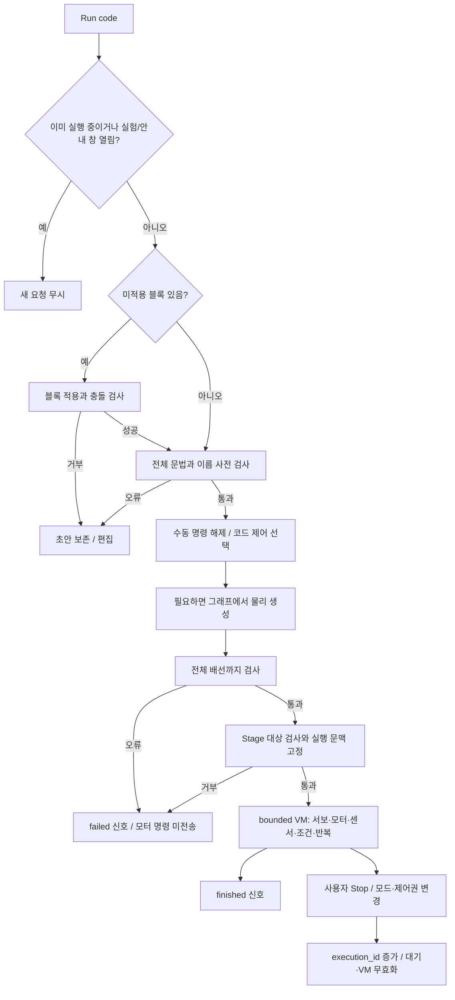
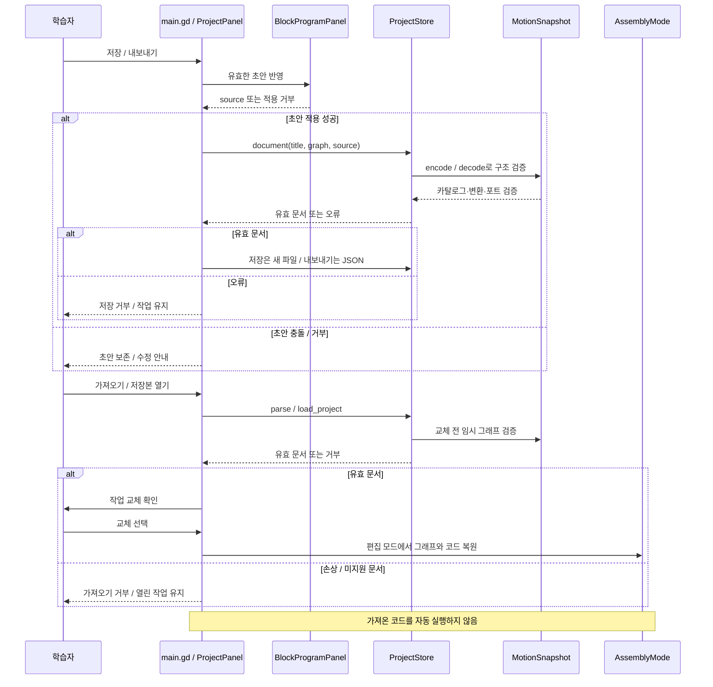
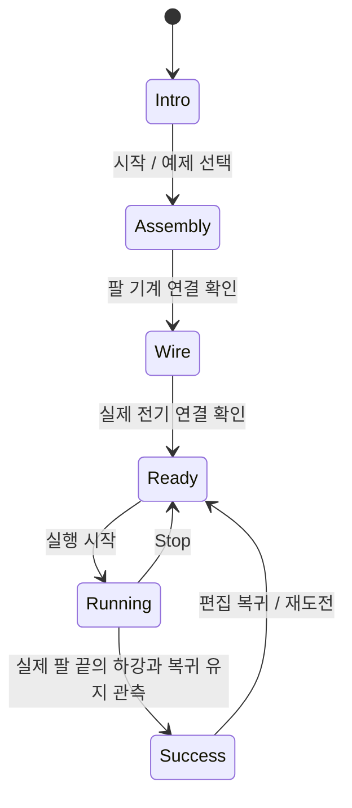
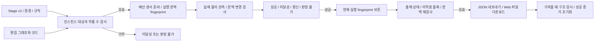

# 실행과 저장 흐름

아래 도식은 [STATUS](STATUS.md)의 통합 소스에 있는 책임과 흐름을 요약해요.

## 코드 실행과 제어권

`scenes/main.gd`가 실행 버튼과 제어권을 조정하고 `MiniRuntime`이 명령을 해석해요. 코드 종료와 임무 성공은 다른 사건이에요. Stop은 VM을 중단하고 DC 모터를 정지하며 서보의 마지막 목표를 유지해요. 진행 중 Stage 시도는 cancelled로 기록해요. 물리 정지나 초기 자세 복원으로 해석하지 않아요. 편집 모드 복귀는 `RunMode.teardown()` 뒤 원본 그래프를 다시 보여줘요.

## 저장과 가져오기

각 화살표는 책임 간 논리 호출을 요약해요. 거부 경로에서는 이후 저장/교체 호출을 하지 않아요. 저장 중인 그래프는 편집 원본이며 현재 강체 위치가 아니에요.

## 깃발 임무

이것은 대표 경로예요. 그래프를 관찰해 기계 연결이 없어지면 Assembly, 배선이 없어지면 Wire로 돌아가는 경로가 모든 관련 상태에 추가돼요. 실제 전이는 [FlagMission._build_chart](../src/ui/flag_mission.gd), 실제 판정은 `_observed_flag_raised()`를 확인해요. 정확한 높이·유지 조건은 [FLAG_MISSION](FLAG_MISSION.md)에 있어요. 깃발 완료가 학습 효과나 다른 로봇의 성공을 인증하지 않아요.

## Stage 판정과 공유

목표·그래프·코드·센서 조건 변경은 이전 성공 증거를 무효화해요. 편집 모드 복귀만으로 성공 증거를 지우지는 않아요. Stage의 센서는 학습 코드가 직접 읽지 않아도 그래프 배선에서 준비한 뒤 실행 문맥을 고정해요. 누락·중복·교체 대상, 센서/물리 오류는 판정 불가, 시간초과·프로그램 오류는 미달성, 사용자 중단은 cancelled예요. 종료한 시도의 늦은 결과는 적용하지 않아요. 범위 밖 초음파는 null 관측으로 계속 실행해요.

규칙은 선언형 수치이며 임의 판정 코드를 실행하지 않아요. 코드 종료 후에도 물리 목표 관측은 계속될 수 있고, 프로그램 오류/중단은 시도를 종료해요. 실패 이유와 복구 행동은 과제 패널과 공통 상태 표시줄에 나타나요. 서버 공유·계정·검증 서명은 미구현이에요. [계약 상세](STAGE_CONTRACTS.md)를 함께 읽어요.

## 소스와 확인할 검사

[main.gd](../scenes/main.gd), [MiniRuntime](../src/runtime/mini_runtime.gd), [RunMode](../src/runtime/run_mode.gd), [BlockProgramPanel](../src/ui/block_program_panel.gd), [ProjectPanel](../src/ui/project_panel.gd), [FlagMission](../src/ui/flag_mission.gd)가 근거예요. 검사는 [core_authoring](../tests/core_authoring_check.gd), [control_flow](../tests/control_flow_check.gd), [flag_mission](../tests/flag_mission_check.gd)를 작업 범위에 맞춰 실행해요. Stage 관련 검사는 `stage_contract_check`, `stage_authoring_check`, `stage_ui_check`, `sonar_stage_check`예요. 실제 통합 결과는 [증거](evidence/merge_2026-09-30/README.md)에 기록해요.
