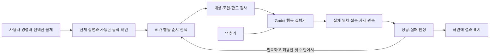

# AI에게 말하면 로봇이 수행하는 명령창

> 날짜가 있는 조사·요구 기록이다. 이후 구현·제품 결정은 [STATUS](STATUS.md)를 따른다.
2026-09-30 사용자 추가 요청 · **요구와 설계 기록, 아직 미구현**.

> 앱 내 창에서 AI에게 명령을 내리면 수행한다. 예: 선반에 저 책을 꽂아 달라.

관련: [제품 경험 개발노트](PRODUCT_EXPERIENCE.md), [기존 AI 동작 탐색](MOTION_LAB.md), [기존 집기 실험](PICKUP_LAB.md).

## 1. 목표 경험

플레이어가 물건을 선택하고 평소 말로 부탁하면, 화면 속 로봇이 실제 시뮬레이션에서 일을 한다.
사용자는 수행 과정을 보고 중간에 멈추거나 지시를 바꿀 수 있다.
`책을 어떻게 꽂는지 설명하는 답변`이나 `팔 움직임 숫자를 제안하는 답변`만으로 이 기능을 완료하지 않는다.

예상 흐름:

1. 책을 클릭하면 외곽선과 이름이 표시된다. 명령창에 `선택: 파란 책`이 붙는다.
2. `저 책을 선반 아래 칸에 꽂아줘`라고 입력한다.
3. AI는 장면의 실제 책·선반 칸·로봇 능력을 확인한다. 후보가 여럿이고 선택으로도 구별되지 않을 때만 대상 선택을 요청한다.
4. `파란 책을 아래 칸에 꽂을게요`와 짧은 진행 단계가 보인다. 사용자가 이미 연결 서비스·비용 범위를 확인했다면 바로 수행한다.
5. 장면에서 이동, 집기, 정렬, 삽입, 놓기가 진행된다. 현재 단계를 짧게 표시한다.
6. 손을 뗀 뒤 책이 목표 칸에서 안정적으로 유지되는지 확인하고 결과를 말한다. 실패하면 관측 사실과 가능한 다음 행동을 제시한다.

이는 목표 시나리오다. 현재 Ssok에는 책·선반 과제, 대상 식별, 범용 행동 계획기와 삽입 제어기가 없다.

## 2. 명령창 UI

- 3D 장면을 가리지 않는 접이식 패널을 기본으로 한다. 좁은 창에서는 하단 패널을 검토한다.
- 입력란 예: `로봇에게 시킬 일을 적어 주세요`.
- 현재 수행 가능한 예시만 보여 준다. 첫 버전에는 `이 상자를 들어 올려줘`, `내려놓아줘`, `멈춰`처럼 검증한 동작만 노출한다.
- 위에는 선택한 대상, 연결 서비스와 과금 방식, 설정한 호출 한도를 짧게 보여 준다. 세부 정책은 펼쳐 볼 수 있지만 첫 사용 고지를 생략하지 않는다.
- 전송 후에는 긴 대화 로그보다 `대상 확인 → 집기 → 결과 확인` 같은 실행 상태를 우선한다. 이는 실행 계획 요약이며 모델의 내부 추론을 표시하는 기능이 아니다.
- `멈추기`는 항상 보이게 하고 로컬에서 즉시 처리한다. API 응답을 기다리지 않는다.
- 명령 이력에는 사용자의 말, 선택한 대상, 수행한 행동, 실제 결과가 남는다. 재실행은 현재 장면으로 다시 검사한다.
- `다시 하기`와 `원래 조립으로 돌아가기`를 구별한다. 저장한 원본을 덮어쓰지 않는다.
- AI가 없거나 연결되지 않아도 직접 조립·조종·과제를 계속 할 수 있게 한다.

## 3. AI와 로봇 제어의 역할



AI는 `무슨 일을 어떤 순서로 할지`를 정한다. 각 관절의 제어와 60Hz 물리는 검증한 로컬 제어기가 담당한다.
프레임마다 모델을 호출하지 않는다. 장면 데이터만으로 대상이 명확하면 이미지 해석 호출을 필수로 만들지 않는다.

### 장면 문맥

현재 `ConnectionGraph`와 런타임 관측에서 필요한 문맥을 읽어 만든다. 두 번째 조립 데이터 원본을 만들지 않는다.
책/선반처럼 새로운 환경 객체의 저장 방법은 후속 ADR에서 정의한다.

- `scene_revision`, 실행 ID, 현재 선택 ID.
- 물체 ID, 사용자에게 보이는 이름·종류·구별에 필요한 속성, 위치/크기/방향, 현재 상태.
- 선반 칸의 대상 영역과 접근 방향. 장식 메쉬 전체를 임의로 목적지로 사용하지 않는다.
- 현재 로봇이 지원하는 동작 목록과 전제 조건, 범위, 현재 상태.
- 요청 시점 이후 객체가 사라지거나 장면이 바뀌면 이전 계획을 그대로 적용하지 않는다.

`저 책`은 선택 ID로 연결한다. 선택이 없고 책이 두 개라면 물체 이름/강조로 묻는다. 모델이 존재하지 않는 책·좌표·로봇 능력을 만들어도 실행기가 거부한다.

### 행동 계약 (설계 예시)

```json
{
  "scene_revision": "current-revision",
  "steps": [
    {"action": "pick_up", "object_id": "book_blue"},
    {"action": "insert_into", "object_id": "book_blue", "target_id": "shelf_lower_slot"},
    {"action": "release", "object_id": "book_blue"}
  ]
}
```

위 JSON은 계약 설명용이며 현재 실행 가능한 API가 아니다. 단계 수, 대상 ID, 행동 이름과 인자 범위를 실행기가 검사한다.
현재 집기는 도달 가능한 `cargo_box` 하나와 특정 배선/로봇을 요구한다. `book_blue`를 기존 상자 집기에 대입한다고 책 집기가 지원되는 것은 아니다.
LLM이 만든 GDScript, Python, 셸 명령을 그대로 실행하지 않는다.

## 4. 실행 상태와 중단

`대기 → 해석 중 → (대상 확인 필요) → 실행 중 → 결과 확인 → 완료 / 실패 / 중단` 상태를 구별한다.
한 로봇에는 한 과제만 실행한다. 새 지시가 오면 현재 작업을 교체할지 확인하거나 안전한 중단 지점에서 변경한다.
`멈춰`와 중단 버튼은 항상 우선하며 현재 로봇 상태를 보존한다. 물리 시뮬레이션을 순간이동으로 초기화하거나 잡고 있는 물체를 무조건 떨어뜨리는 것으로 중단을 구현하지 않는다.
어떤 자세/그립을 유지하는지는 해당 제어기 계약에 명시한다.

사용자의 과제 명령은 해당 과제를 수행하라는 의사 표시다. 제공자·모델·한도·비용 고지가 이미 확인된 범위이면 매 동작마다 승인창을 띄우지 않는다.
대상 모호성, 지원하지 않는 행동, 새 과금 경로, 한도 초과, 원본 저장/코드 변경처럼 범위를 바꾸는 순간은 별도로 처리한다.
동의 전 첫 유료 요청은 시작하지 않는다. 다중 단계·재계획도 하나의 정해진 비용/호출 한도에 포함한다.

## 5. 성공은 실제 장면에서 확인

책꽂기 완료 조건은 모델의 완료 메시지가 아니다. 다음 항목을 실제 센서/물리 상태로 검사하도록 구현한다.

- 의도한 책 ID가 의도한 칸 영역 안에 있다.
- 요구한 삽입 방향과 허용 범위를 만족한다.
- 선반과 비정상적으로 관통하지 않는다.
- 손에서 놓은 뒤 정해진 시간 동안 목표 위치에 머문다.
- 로봇이 넘어지거나 실행이 취소된 상태가 아니다.

정확한 허용 오차와 유지 시간은 책·선반·제어기가 생긴 뒤 과제 명세에 고정한다. 지금 임의 수치를 성공 기준으로 인증하지 않는다.
실패 원인이 확실하지 않으면 `책이 칸 밖으로 떨어졌어요`처럼 관측을 말한다. `마찰이 부족해요`처럼 원인을 지어내지 않는다.
재계획은 허용 횟수 안에서 하고, 성공 판정을 쉽게 바꾸지 않는다.

## 6. 콘텐츠가 되는 방식

대표 장면은 **작은 로봇과 방을 함께 정리하는 놀이**로 검토한다.
`파란 책을 꽂아줘` → `상자를 색별로 옮겨줘` → `통로를 비워줘`처럼 장면을 바꾸면 목표가 달라진다.
플레이어는 명령을 더 분명히 하거나, 로봇 구조·배선·코드를 바꾸거나, 과제를 직접 수행하며 다른 해법을 찾는다.
AI는 완성 장면의 구경거리뿐 아니라 내가 만든 로봇의 능력을 시험하는 상대가 된다.

공유 영상은 사용자의 한 문장과 실제 수행을 같이 보여 준다. 잘 안 된 시도와 바꾼 점도 포함하면 기능 설명보다 Ssok의 재미가 읽힌다.
미구현 행동을 할 수 있는 것처럼 예고 영상에 넣지 않는다.

## 7. 구현 순서

| 단계 | 범위 | 완료 기준 |
|---|---|---|
| A. 명령이 실제 행동으로 이어짐 | 명령창, 선택 대상, 한 제공자, 현재 Kit의 도달 가능한 상자 집기·유지·놓기·중단 | 한국어 표현이 달라도 지원 행동으로 연결. 실제 관측 검증. 한도/취소/오류 처리. 가짜 응답을 AI 연결 성공이라고 부르지 않음. |
| B. 책상 위 책꽂기 | 고정 위치 로봇 또는 제한된 도달 범위, 책 하나와 선반 칸 하나, 정렬·삽입 행동 | 사용자가 말한 책을 집어 칸에 놓고 손을 떼도 유지. 완성 과제와 실패 사례 검증. |
| C. 방 안 이동과 복수 물체 | 안정된 이동, 경로/도달 가능성, 여러 책과 칸, 장애물, 제한된 재계획 | 잘못된 대상·막힌 길·물체 이동을 처리. 현재 Kit 보행 완료를 선행 가정하지 않음. |
| D. 열린 조립과 복합 과제 | 사용자가 만든 로봇의 능력 검사와 더 긴 임무 | 지원 범위가 달라지면 계획도 달라짐. 안 되는 행동을 설명하고 가능한 선택을 제시. |

첫 단계는 비용 없는 fake/mock 어댑터로 실행기·실패 처리를 검증하고, 실제 제공자 경로는 별도로 검증한다.
완료 보고에는 mock과 실제 API를 구별한다. 실사용자는 연결한 계정 정책을 따른다.
연결 서비스만 바꿔도 로봇에 없던 이동·그립·삽입 능력이 생기지는 않는다.

구현 전에 [ADR0008](adr/0008-bounded-motion-learning-bridge.md)의 네 숫자 제안 범위와 [ADR0009](adr/0009-humanoid-actuation-and-contact-grasps.md)의 집기 추상화를 확장하는 후속 ADR이 필요하다.
현재 MCP의 `start_motion_search`는 이 실행기가 아니다. AI 채팅창, 장면 문맥, 행동 실행기, 성공 판정까지 연결해야 한다.

## 8. 연구 근거와 향후 검증

[기존 기술 재사용 비교](research/existing-robot-task-technologies-2026-09-30.md)를 구현 전에 함께 읽는다. Beehave의 행동 실행, MoveIt Task Constructor의 집기/배치 계획, BEHAVIOR의 실제 책 정리 과제, LeRobot/openpi 정책을 비교했다. 먼저 기존 구현의 적용 가능성을 작은 실험으로 확인하고 자체 구현 범위를 정한다. 이번 조사는 도구 설치나 Ssok 통합 성공을 뜻하지 않는다.

[SayCan 공식 연구 페이지](https://say-can.github.io/)는 언어 모델의 고수준 지시와 로봇의 가능한 동작을 연결하는 방법을 보여 준다.
Ssok에서는 `언어 이해 + 현재 장면 + 검증된 행동`이라는 구성을 참고한다. SayCan 알고리즘을 구현·재현했다거나 그 논문의 성공률을 달성했다는 뜻은 아니다.
페이지가 설명하는 후속 환경 피드백의 필요성까지 고려하여, 단계마다 실제 결과를 확인하는 실행 구조를 요구한다.

후속 검증에는 다음 반례를 포함한다: 존재하지 않는 책, 같은 이름의 책 2개, 선반 칸이 가득 참, 도달 불가, 집기 실패, 실행 도중 장면 변경, API 시간초과, 중단 직후 늦게 도착한 응답, 중복 전송, 한도 소진.
로컬 중단은 네트워크 없이 작동해야 하고, API가 실패했다고 같은 유료 요청을 자동 반복하면 안 된다.
장면에 붙인 사용자 이름·라벨은 데이터로만 읽고 도구/시스템 지시로 실행하지 않는다.

확인일: 2026-09-30. 사용자 예시를 제품 요구로 기록했고 현재 코드의 `PickupTrial`·`PickupPolicy`와 기존 MCP 범위를 대조했다. 신규 명령창과 행동 실행 코드는 아직 작성하지 않았다.
