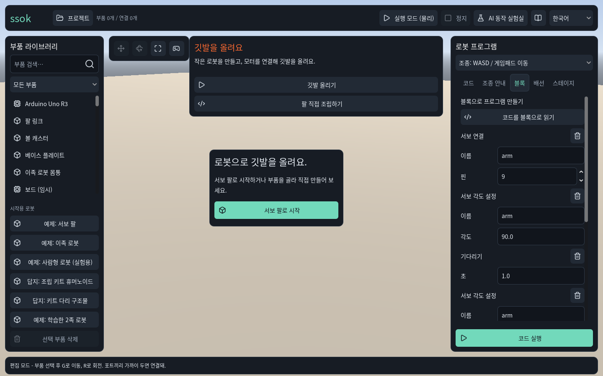
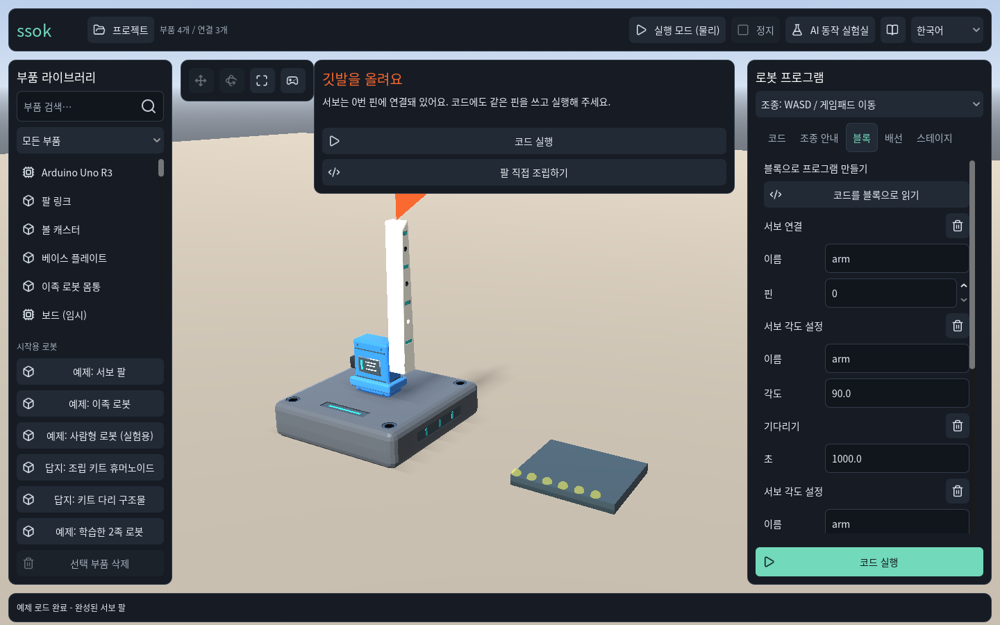
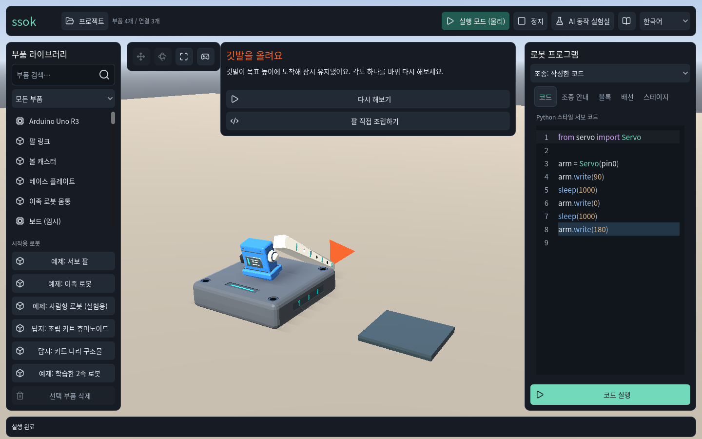
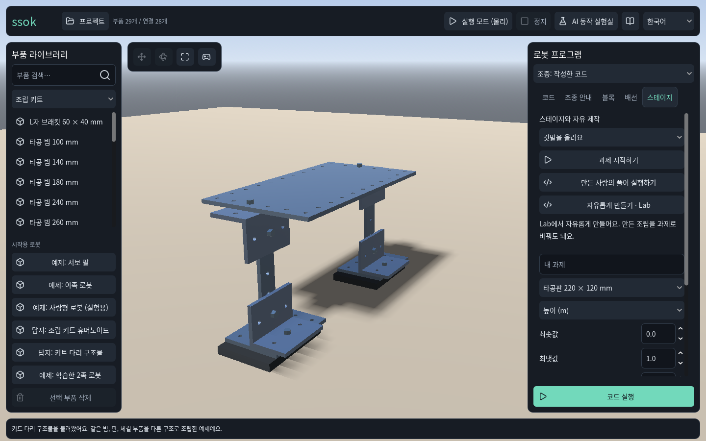
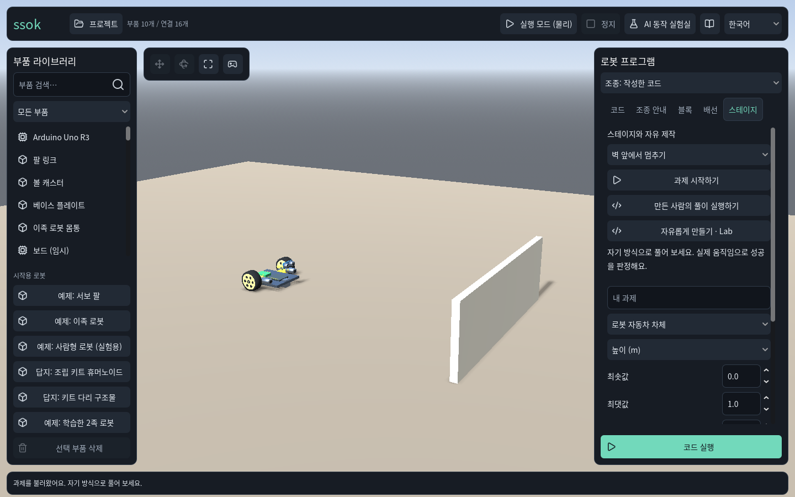

# SSOK 출시 전 화면·게임성·부품·커스텀 점검

2026-09-30 · Codex · `90b9930`의 제품 감사와 후속 제안. 이후 통합 상태는 [STATUS](STATUS.md)를 따른다.

현재 상태는 **로봇 제작 도구의 기능이 갖춰지고 있는 단계**이며, 화면에서 읽히는 놀이 목표·진행과 나만의 외형을 만드는 경험은 아직 약하다. 부품이 전혀 부족한 것은 아니다. 실제 목록은 **75종**이지만 규격 변형·구형 휴머노이드 모듈·환경 소품이 포함된다. 우선순위는 `화면과 블록 UX → 목표·결과·재도전 → 부품 탐색 → 외관 커스텀 → 새로운 기능 부품`으로 제안한다.

이 문서의 신규 화면과 기능은 **제안**이다. 이번 작업은 코드 개선이나 새 미술 적용 완료가 아니다.

## 확인 범위와 사용자 목표

- 최신 기능 통합 작업 트리의 clean commit `90b9930`을 별도 폴더에 복사해 실행했다. live 작업 트리는 수정하지 않았다.
- 실제 Godot 4.7.2 GL Compatibility, 1440×900, 한국어 화면 5장을 이번 실행에서 저장하고 각 원본을 열어 확인했다. 아래는 생성 이미지가 아니라 실제 앱이다.
- 첫 진입 → 완성 팔로 조작 → 실제 깃발 성공 → Kit 자유 제작/출제 → 자동차 과제 진입을 자동 조작했다. 직접 부품을 끌어 조립·배선하는 초심자 행동은 재연하지 않았다.
- 사용자 목표: 자기 조합으로 과제를 깨고 Lab에서 자유롭게 만드는 전 연령 제품. 첫 5분 기준은 초등 고학년, 블록 먼저·micro:bit 먼저. Kit 보행/RL 실험 재개를 제안하지 않는다.
- 근거: [캡처 메타데이터](evidence/prelaunch_ux_2026-09-30/evidence.json), [원본 인벤토리](evidence/prelaunch_ux_2026-09-30/inventory.json), [부품 목록 CSV](evidence/prelaunch_ux_2026-09-30/parts.csv), [조작 스크립트](evidence/prelaunch_ux_2026-09-30/capture.gd.txt), [런타임 로그](evidence/prelaunch_ux_2026-09-30/capture.log).

## 화면 흐름과 상태

| 단계 | 실제 화면 | 상태와 영향 |
|---|---|---|
| 1 | 첫 진입 | 개선 필요. 시작 안내가 두 곳이고 부품·코딩·실험실·여러 예제가 한꺼번에 등장한다. |
| 2 | 깃발 조립/블록 | 동작 기반 있음, UX 개선 필요. 실제 핀 안내는 좋지만 블록이 긴 입력 폼처럼 보인다. |
| 3 | 실제 깃발 성공 | 성공·재시도 연결됨, 결과 전달 부족. 실행 때 블록에서 코드 탭으로 바뀌고 성공 측정값/장면 기록이 약하다. |
| 4 | Kit Lab/출제 | 구조 창작 기반 있음, 탐색과 커스텀 부족. 실물 썸네일이 없고 플레이·출제 수치가 같은 패널에 섞인다. |
| 5 | 벽 앞 자동차 과제 | 과제 기반 있음, 목표 전달 부족. 차가 작고 정지 구역·거리 기준이 장면에 표시되지 않는다. |

### 1. 첫 진입

강점: 첫 깃발 안내와 시작 버튼, 검색·분류, 코드/블록/배선 선택이 있다. 위험: 상단 깃발 임무와 중앙 시작 안내가 중복되고 왼쪽 예제 버튼들과도 경쟁한다. 빈 장면인데 오른쪽에 긴 코딩 폼과 코드 실행 버튼, 상단에 수동 물리 실행과 AI 실험실이 함께 있다. 첫 행동 하나를 정하기 어렵다.

권고: `이어서 하기 / 도전 고르기 / 자유롭게 만들기`를 분명히 구분하고 첫 과제에서 필요한 행동부터 보여준다. 실험·전시 예시는 별도 진입으로 정리한다. 조립·코딩·실행 중 필요한 도구의 위계를 다르게 둔다.

### 2. 깃발 팔과 블록

강점: 로봇 부품의 형태·재질이 구분되고 실제 연결된 pin0을 안내한다. 위험: 블록 하나가 이름·핀·각도 등 여러 줄짜리 폼이라 프로그램 순서를 한 화면에서 읽기 어렵다. 넓은 설명 패널이 상단 장면 공간을 차지한다.

권고: `서보 [팔] 각도를 [90]도로`, `기다리기 [500]ms`처럼 매개변수를 문장 안에 넣고 순서·반복·조건의 포함 관계가 보이는 블록을 만든다. 보드 API에서 블록을 생성하는 기존 구조를 유지한다. 사용자가 고르지 않은 로봇 예제를 자동 정답으로 고정하지 않는다.

### 3. 실제 깃발 성공

강점: 로그의 `Success`, 실제 관측에 따른 성공 문구, 다시 해보기 경로가 확인된다. 연결·성공 효과음도 소스에 있다. 위험: 실행 버튼을 누르면 블록에서 코드 탭으로 바뀐다(`scenes/main.gd:926`). 성공 문구와 현재 팔 자세를 대조할 목표선·측정값·성공 시점 장면이 부족하다. 첫 성공은 실측 높이가 바로 보이지 않고, 반복 성공 비교 문구가 후속 실행에만 나타난다.

권고: 블록 사용자는 블록 화면을 유지하며 현재 실행 블록을 강조한다. 장면의 목표 높이 표식과 실제 값, 판정에 사용한 성공 시점 장면을 함께 보여준다. 다시 실행·한 부분 바꾸기·다음 과제가 자연스럽게 이어지게 한다. 성공할 때마다 점수나 원인을 임의로 지어내지 않는다.

### 4. Kit Lab와 출제

강점: 29개 단위 부품/28개 연결로 다른 구조를 만들 수 있고 자유 제작에서 과제 출제로 이어진다. 위험: 왼쪽이 같은 상자 아이콘과 규격명이라 각 부품의 형태·쓰임새를 예상하기 어렵다. 오른쪽 과제 플레이와 최소/최대/유지시간 등의 출제 도구가 한꺼번에 노출된다. 외관 꾸미기 도구는 보이지 않는다.

권고: 실제 3D 썸네일, 부품군 묶음, 크기·연결 호환·예시 쓰임새를 표시한다. `과제 풀기`와 `과제 만들기`는 별도 화면/접힘 상태로 정리한다. 부품 인스턴스의 색·데칼·로봇 이름과 대표 이미지로 내 작품을 인식하게 한다.

### 5. 자동차와 벽

강점: 기존 모터·바퀴·보드·초음파를 실제 그래프로 조합한 자동차 과제가 있다. 위험: 벽과 차만 있는 큰 바닥에서 차가 작게 보이고 `5~10cm 앞 정지` 같은 목표 기준을 장면/플레이 HUD에서 읽을 수 없다. 오른쪽에는 여전히 출제 폼이 큰 면적을 차지한다.

권고: 시작선·주행 경로·정지 구역·현재 거리·정지 유지 시간을 필요한 과제에만 표시하고 플레이 영역에 맞게 카메라를 잡는다. 실패하면 실제로 관측한 결과와 고칠 수 있는 행동을 연결한다. 이번 감사는 진입만 확인했으므로 자동차 성공률은 여기서 주장하지 않는다.

## 실제 부품 인벤토리

메인 앱의 `_load_part_defs()`를 호출해 얻은 목록이며 단순 파일 개수와 다르다. ID는 모두 고유하다. 환경 벽·연습 상자 등도 포함하므로 로봇 기능 부품 75개라고 홍보하면 부정확하다.

| 카탈로그 | 정의 수 | 구성/의미 |
|---|---:|---|
| 기본·차량·보드 | 19 | 서보 팔/이족 기초, micro:bit/Uno, 드라이버 2종, TT 모터·바퀴·캐스터·차체, HC-SR04, 벽 |
| 이전 휴머노이드 | 9 | 몸통·팔/다리 서브어셈블리와 보드·상자 |
| 모듈 휴머노이드 | 18 | 프레임·관절 서보·커버·그리퍼 손·보드 |
| 단위 조립 키트 | 25 | 빔·판·브래킷·모터·제어기·체결/접촉 부품·광학 센서 모형 |
| 학습 이족 | 4 | 몸통·링크·토크 서보·별도 초음파 정의 |
| 합계 | **75** | 기본 UI 분류상 구조48/액추에이터15/전자12. 종류가 겹치는 실제 기능도 있다. |

조립 키트 25종의 내부 구성: 빔6, 판6, 브래킷3, 모터2, 제어보드2, 커플러·볼트·너트·패드·스페이서·광학 센서 각1. 길이/크기 변형을 빼고 새 기능을 만드는 부품군으로 보면 숫자는 더 작다.

현재 학습 코드의 대표 작동 축은 **서보 각도, DC 바퀴 구동, HC-SR04 거리 읽기**다. `kit_optical_sensor`는 카탈로그에 있지만 현재 학습 API에 광학/라인/색 읽기가 없다. `learning_hc_sr04`도 별도 ID이며 현재 `sonar_on_pins()`의 지원 대상은 `hc_sr04`다. 이름이 센서인 부품을 전부 동작하는 센서로 세지 않는다.

양을 무작정 늘리기보다 기존 단위 부품의 대체 조립과 연결 위치를 잘 드러내는 것이 먼저다. 신규 기능은 합의한 레벨과 연결해 우선순위를 둔다: 실제 라인/색 센서는 라인 트레이서·색 분류, 범용 서보 집게는 운반, 기어/풀리는 구동 전달을 위한 후속 후보다. 현재 휴머노이드의 전용 그리퍼 손을 모든 로봇에 쓰는 범용 집게로 간주하지 않는다. 새 센서·기구는 물리·API·블록·레벨 검증이 함께 필요하다.

## 현재 커스텀 범위

| 축 | 현재 | 부족한 부분 |
|---|---|---|
| 구조 | 부품 추가/삭제·이동/회전·포트 연결·배선·되돌리기, 같은 Kit로 로봇/다리 예시 | 쉬운 복제/대칭 도구와 호환 조합 안내는 추가 후보 |
| 행동 | 각도·속도·타이밍·변수/조건/반복·거리 센서를 사용하는 코드/블록 | 블록의 시각적 포함 관계와 실행 피드백 |
| 과제 | Lab 목표·조건 수치 설정, 직접 성공한 과제 파일 내보내기/가져오기 | 별도 출제 UX, 장면 목표 표시, 챕터맵/진행 기록 |
| 이름/저장 | 프로젝트 이름, 로컬 저장·프로젝트 JSON 공유 | 작품 썸네일/내 로봇 전시함 |
| 외형 | 부품마다 고정 모델/재질, 일부 탈착 커버 부품 | 사용자 색칠·데칼·외관 테마·부품별 별명·저장 후 외관 복구 |
| 크기/물성 | 카탈로그의 고정 규격·물성 | 임의 리사이즈/재질 물성 조절 UI 없음; 무제한 크기 조절을 출시 필수로 제안하지 않음 |

근거: `PartDef`는 기하/포트/물리·보드 필드, `ConnectionGraph.parts`는 PartDef/Transform, `MotionSnapshot`은 ID/강체 Transform과 연결을 저장한다. 사용자 색/데칼 저장 필드가 없다. 프로젝트 이름은 이미 가능하므로 이름 전체가 미구현이라고 하면 틀리다.

외관 변경을 개발할 때는 인스턴스별 시각 필드를 그래프/프로젝트 버전과 연결하고, 조립/실행/저장/되돌리기에서 동일하게 유지한다. 처음에는 색과 데칼만 시각 효과로 적용해 질량·마찰·성공 조건을 바꾸지 않는 범위가 적절하다. 기존 파일 읽기와 검증·인증 정책은 후속 ADR/스키마에 기록한다.

## 출시 전 우선순위와 완료 기준 — 제안

| 순서 | 작업 | 완료를 판단할 사용자 행동 |
|---|---|---|
| P0-1 | 대표 장면 1개로 아트 방향 정하기: 작은 로봇 공방/작업판, 부품 재질·빛·카메라·공간 목표 | 제목을 가려도 SSOK 조립 놀이로 보이고 로봇/목표/다음 행동이 한눈에 읽힘. 실제 앱과 Web에서 확인 |
| P0-2 | 조립/코딩/실행 화면 정리 + 엔트리식 블록 | 초등 고학년이 이름·핀 폼을 이해하기 전에 행동 블록을 고르고 실행/수정함. 블록 실행에서 코드 탭으로 강제 이동하지 않음 |
| P0-3 | 과제 플레이 화면: 목표 표식·진행·관측 결과·재도전 + 15개 레벨의 챕터 구조 | 플레이와 출제 폼이 분리되고, 왜 성공/미달인지 읽고 다음 시도를 함. 부품/코드를 바꾼 여러 풀이 허용 |
| P0-4 | 실제 썸네일 부품 트레이 + 기본 외관 꾸미기 | 길이 변형을 같은 부품군에서 고르고 필요한 연결 호환을 이해함. 색·데칼을 바꾼 작품을 저장/재개·되돌리기·실행해도 유지 |
| P1 | 기능 부품 확장, 시도 비교/공유 UX, 더 많은 검증된 레벨 | 새 기능이 실제로 다른 해법/과제를 만들며 숫자만 늘지 않음. 예시의 해법을 그대로 따라하지 않아도 성공 |

내장 기본 과제는 현재 **3개**(깃발, 결승선, 벽 앞 정지)다. 합의한 15개 스테이지의 개발 완료로 간주하지 않는다. 15개 순서는 기존 사용자 결정을 유지하고, 튜토리얼은 조작 연습으로 분리한다. 위 표는 우선 작업 단위이지 승인된 전체 출시 범위를 축소한 결정이 아니다.

랩 동료·교수님에게 설명 없이 해보게 하여 첫 동작까지 시간, 한 번 성공, 스스로 한 부분 수정 후 재실행 여부를 관찰한다. 첫60초/5분 목표는 검증할 가설이다. 기존 자동 검사 통과를 사용자 재미·이해의 증명으로 바꾸지 않는다.

## 자산과 제약

- 연결·선택·성공에 쓰는 [Kenney Interface Sounds](https://kenney.nl/assets/interface-sounds)는 이미 소스에 들어 있다. 공식 페이지의 CC0 표기를 2026-09-30 재확인했다. 이번 실행은 Dummy 오디오라 소리의 질/볼륨은 평가하지 않았다. 조립/배선의 실제 사건과 시각 피드백을 함께 연결하는 방향을 유지한다.
- [Kenney Furniture Kit](https://kenney.nl/assets/furniture-kit)도 공식 CC0 팩이지만 기존 기록에서 장면 부적합으로 제외됐다. 단순 가구 추가를 현재 문제의 해결로 가정하지 않는다. 먼저 플레이 영역의 크기·카메라·목표 표식을 정해야 한다.
- GDScript·GL Compatibility·Web/desktop·ConnectionGraph·실제 물리 판정의 기존 결정은 유지한다. 미술 개선을 위해 엔진/렌더러를 바꾸거나 성공 동작을 꾸미지 않는다.
- 이전 3가지 계약 보완은 별도 브랜치 통합 대기 상태다. 이 화면 감사로 통합/원격 CI/공개 배포가 끝났다고 주장하지 않는다.

## 접근성 위험과 확인 한계

- 긴 부품명은 줄임표, 작은 구멍/체결부는 선택 부담이 있을 수 있다. 썸네일에도 이름·키보드 초점·연결 호환 텍스트가 필요하다.
- 바닥과 회색 구조물, 얇은 공간 표식은 대비가 약해질 수 있다. 목표/성공/연결 상태는 색·소리만으로 전달하지 않는다.
- 키보드만으로 실제 조립/배선/블록 작업을 완주했는지, 초점 순서, 스크린리더, 색각 조건, 작은 화면, 고배율, 다른 언어의 재배치, 효과 줄이기는 이번에 검증하지 않았다. WCAG 준수를 선언하지 않는다.
- 자동 조작·네이티브 한 해상도·소리 꺼짐 조건이다. 사용자 관찰, Web 실제 환경, 전체 성능/회귀 검증은 후속이다. 다섯 화면과 깃발 Success 기록 후 캡처 프로세스가 SIGTERM(exit143)으로 종료됐다. 원인은 확인하지 못했으며 정상 종료 검증으로 기록하지 않는다.
- 이번에는 사용자 UI/언어팩을 바꾸지 않았다. 따라서 번역 추가는 없으며 구현할 때 EN/KO/ZH_CN/JA를 함께 변경해야 한다.

다음 구체 작업은 대표 조립/플레이 화면의 시각안과 필요한 조작을 먼저 정한 뒤, 같은 소스 기반에서 화면/블록/부품 트레이를 구현하는 것이다. 색칠·데칼은 파일 버전과 복구 조건까지 정하고 이어간다.
