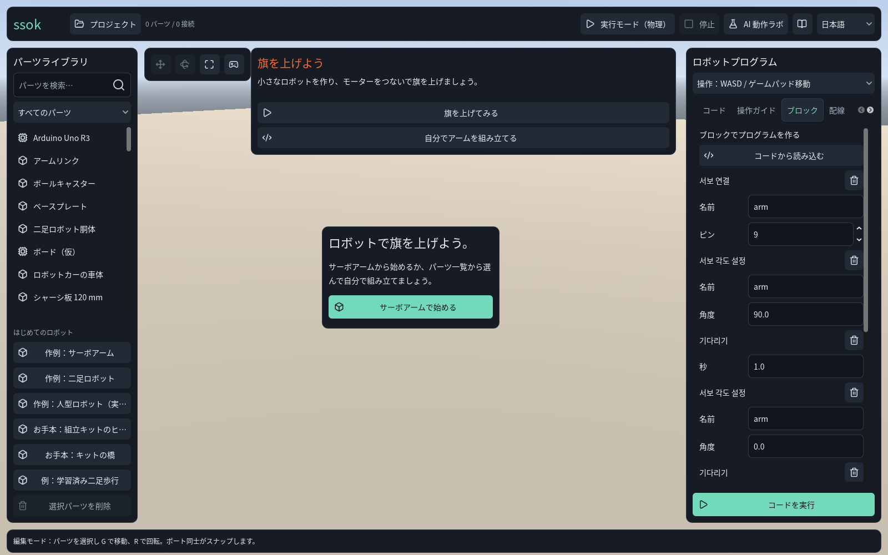
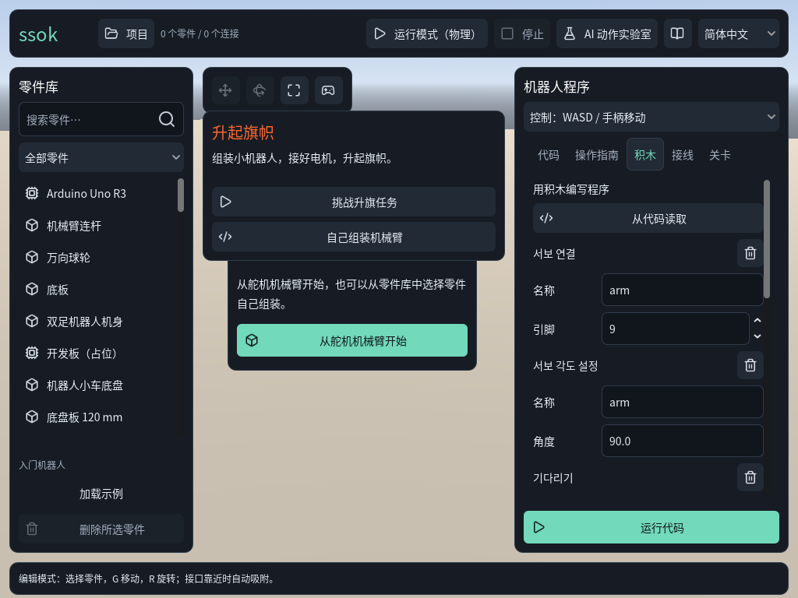
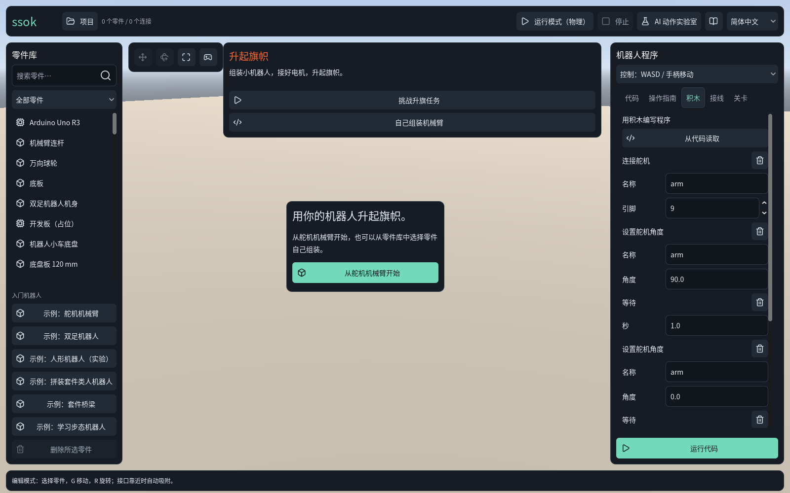
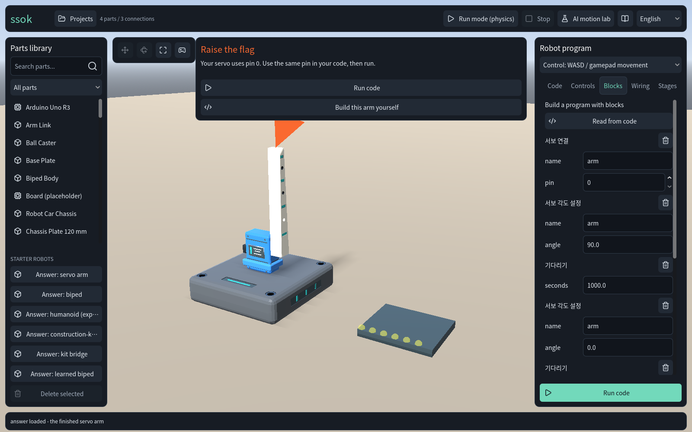

# 설정·테마·언어 실제 화면 감사

2026-09-30 Codex. 사용자 질문: 설정·테마·언어 전환의 자연스러움과 사용성 원칙·최근 지침을 따르는가?

**언어 기능의 기반과 중앙 다크 팔레트는 좋아요. 다만 살아 있는 블록 제목 번역, 전환 후 포커스와 작은 창의 화면 겹침은 보완이 필요해요.** 설정 화면과 외관/글자 배율/효과음 선호 기능은 이 소스에서 확인되지 않았어요.

## 소스와 방법

- 감사 소스는 **4340fe2**, 독립 detached 작업실 `ssok-settings-audit-20260930`이에요. 문서 브랜치의 구조 도식 기준 **2759fde와 다른 소스**이며 출시된 앱을 검사한 것이 아니에요.
- 감사 중 live 통합 소스는 a1c4417로 진행됐어요. 관련 diff에서 블록 제목 원문 소실·언어 선택 후 포커스 해제·좁은 창 카드 위치의 수정은 관찰하지 않았지만 새 소스의 화면을 재검증한 것은 아니에요.
- Godot **4.7.2**, Linux GL Compatibility 실제 viewport를 PNG로 저장하고 7장 모두 열어 검수했어요. 웹 브라우저가 아닌 네이티브 앱 검사예요.
- 실제 UI 노드를 띄우고 언어 선택기의 연결된 `item_selected` 신호로 전환했어요. 사람의 마우스·키보드 과제 수행 전체를 재현한 검사는 아니에요.
- XDG 데이터/설정 경로를 합성 테스트 전용으로 분리해 기존 개인 언어 선호나 프로젝트를 변경하지 않았어요. 앱 소스와 다른 live owner 작업실은 수정하지 않았어요.
- 창은 `1600×1000`, 축소는 `1024×768`. 로케일 전환과 재시작, 코드/미적용 블록 초안/탭/편집 모드/그래프의 보존을 확인했어요. 보존 검사는 빈 그래프와 4개 부품·3개 연결의 micro:bit 팔 양쪽에서 수행했어요.
- [관측 데이터](evidence/settings_ux_2026-09-30/observations.json), [재시작](evidence/settings_ux_2026-09-30/restart.json), [조립 장면](evidence/settings_ux_2026-09-30/populated.json), [색 대비](evidence/settings_ux_2026-09-30/contrast.json), [재현 안내](evidence/settings_ux_2026-09-30/README.md).

## 단계별 화면과 발견

### 1. 한국어 첫 화면 — 기본 구성은 양호

언어 선택기가 우측 상단에 있으며 실제 크기는 104×38 뷰포트 단위였어요. CJK 글리프는 이 화면에서 정상이고 기본 UI는 읽을 수 있어요. 블록부터 시작하지만 실행 모드·실험실·여러 legacy 답지까지 함께 보여 첫 행동의 집중도는 사용자 관찰이 필요해요. 이 이미지는 OS 자동 감지를 검증하기 위해 한국어 OS를 사용한 결과가 아니라 명시적으로 한국어를 적용한 상태예요.

### 2. 한국어 → 영어 — 일부 번역이 남아 있음

버튼·탭·본문·부품은 즉시 바뀌고 학습자 초안은 보존돼요. 하지만 블록 제목 `서보 연결`, `서보 각도 설정`, `기다리기`는 한국어로 남아요. `block_program_panel.gd::_rebuild()`가 원문 대신 `tr(...)` 결과를 Label에 넣으므로 기존 카드가 원문 키를 잃는 것과 일치해요. 선택기에 포커스를 준 뒤 전환 콜백을 실행하면 소유자가 `none`이 되며 `main.gd::_on_language_selected()`의 `gui_release_focus()`와 일치해요. 키보드 사용자에게 현재 위치를 잃게 할 위험이며 실제 키 입력의 후속 이동은 미검증이에요.

### 3. 일본어·중국어 전환 — 같은 문제 재현

기존 블록 제목은 계속 한국어예요. 일본어에서는 우측 탭에 스크롤 화살표가 나타나 모든 탭을 한 번에 보기 어려워요. 현재 스크린샷에서는 글리프 누락을 관찰하지 않았지만 전체 카탈로그·대화상자의 정상 표시를 보장하지 않아요. 코드·변수명은 유지돼요. `SsokLocale.normalize("zh_TW")`도 `zh_CN`으로 변환되므로 지원 범위를 간체라고 명확히 하고 번체권 기본값 처리 방침을 정할 필요가 있어요.

### 4. 1024×768로 축소 — 겹침 보완 필요

상단 언어 선택기는 화면 안에 남지만 임무 안내가 빈 작업실 시작 카드 위로 겹쳐 카드 제목을 가려요. `_layout_flag_mission()`의 좁은 창 위치와 중앙 카드 위치를 함께 조정해야 해요. 시작 버튼은 보이므로 이 증거만으로 전체 사용 불가라고 판단하지 않아요. 장면 카드·측면 패널·글자 확대를 한 레이아웃 규칙으로 다루는 것이 좋아요.

### 5. 앱 재시작 — 언어 저장은 양호

별도 프로세스가 중국어 간체로 시작하고 블록 제목도 중국어로 생성돼요. 따라서 2–3단계 문제는 번역이 전혀 없는 것이 아니라 **이미 만들어진 블록 카드의 즉시 갱신 누락**으로 좁혀져요. 재시작은 언어 선호만 확인했으며 프로젝트 초안의 자동 복원은 검사하지 않았어요.

추가로 실제 팔을 불러와 4부품·3연결, 학습자 코드와 미적용 블록 초안이 있는 상태에서 en/ja/zh_CN 전환 보존을 확인했어요. 실행 중 물리 상태·명령 소유권은 이번 검사 범위가 아니에요.

## 테마·설정·원칙 평가

| 항목 | 관찰/근거 | 판단 |
|---|---|---|
| 언어 찾기 | 상단 선택기, 네 언어의 고유 이름, 저장/즉시 변경 | 기본 접근 경로는 양호 |
| 작업 연속성 | 세 로케일에서 조립·코드·블록 초안·탭·편집 모드 보존 | 검사한 상태에서 양호 |
| 번역 일관성 | 기존 카드 제목은 이전 언어로 남음 | 먼저 보완 |
| 사용자 통제 | 언어 저장 실패 메시지 구현, 전환 후 포커스 해제 | 저장 오류 경로 실제 실행은 미검증; 포커스는 보완 필요 |
| 테마 | SsokTheme의 중앙 팔레트/타이포그래피, 고정 다크 | 기반은 양호, 시스템 외관 대응 미확인 |
| 화면 설정 | 사용자용 테마·글자 배율·음량 설정 경로 없음; 성공 효과음은 고정 volume_db | 개인 선호 설정 제안 필요 |
| 작은 창 | 일부 예제 메뉴 압축은 구현, 중앙 카드 겹침 재현 | 불완전 |
| 접근성 | 토큰 대비·글리프·클릭 영역 일부 관찰 | 전체 준수 판정 불가 |

색상 원본으로 계산한 일반 본문 `#e7edf4 / #171c24`는 **14.51:1**, 보조 문구 `#a3afbe / #171c24`는 **7.68:1**, 보조 문구/raised 표면은 **6.50:1**, Primary 버튼의 어두운 글자/민트 배경은 **10.77:1**이에요. 이 조합들은 [WCAG 일반 글자 4.5:1](https://www.w3.org/WAI/WCAG22/Understanding/contrast-minimum.html) 기준보다 높아요. 경고·선택·disabled·모든 hover 상태와 3D 위의 텍스트를 전부 검사하지는 않았어요.

Nielsen의 [일관성·사용자 통제·상태 표시](https://www.nngroup.com/articles/ten-usability-heuristics/)를 부분적으로 따라요. Fitts/Hick의 법칙을 준수 인증처럼 말하거나 사용자 과제 측정 없이 사용 시간을 추정하지 않아요. 창의 크기, 행동 선택 수와 클릭 거리를 확인하는 설계 관점으로 활용할 수 있어요.

[W3C 언어 탐색](https://www.w3.org/International/questions/qa-navigation-select)의 상단 배치·고유 언어 이름은 현재와 잘 맞아요. [포커스 표시](https://www.w3.org/WAI/WCAG22/Understanding/focus-visible.html)는 keyboard 흐름까지 검증해야 해요. [Apple Dark Mode](https://developer.apple.com/design/human-interface-guidelines/dark-mode)의 시스템 선호 존중은 후속 설계 참고이며, Apple 플랫폼 지침이 Godot의 전체 플랫폼 규칙은 아니에요.

## 권장 우선순위와 한계

1. 원문 키 보존으로 블록 제목·동적 문구 즉시 갱신, 초안을 훼손하지 않는 방식으로 수정.
2. 언어 변경 후 포커스 복원과 작은 창의 카드 겹침 수정.
3. 시스템 선호, 밝은 외관·글자 배율·효과음·UI 연출의 필요를 하나의 설정 경험으로 설계. [검토안](INTERFACE_PREFERENCES.md) 참조.
4. 최초 사용자에게 보여 줄 실험/legacy 예제의 우선순위를 5분 관찰로 검증.

스크린리더·터치·게임패드 전체 탐색·브라우저 확대·웹 영속 저장·OS 테마 전환·실행 중 언어 변경·저장 실패 경로는 미검증이에요. UI 자동화 드라이버는 제한된 상태 재현이며 실제 아동/교사 관찰을 대신하지 않아요. 문서만 추가했으므로 번역팩 변경과 앱 전체 회귀/내보내기는 이번에 수행하지 않았어요. 이 발견들은 아직 앱 수정 완료가 아니에요.
