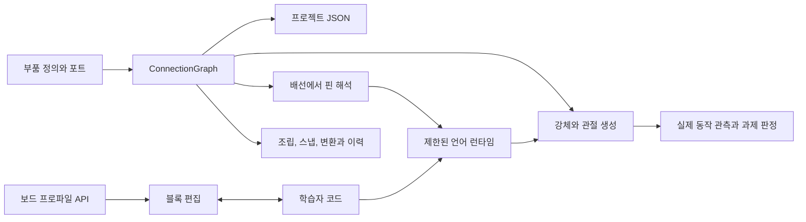
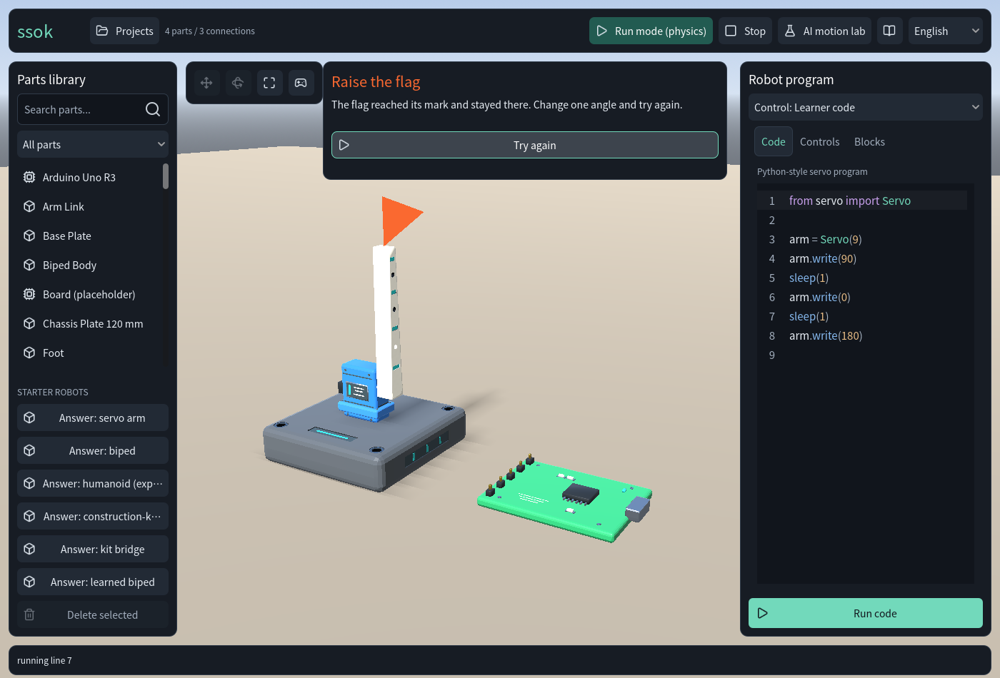

# Ssok 기술노트: 조립형 로봇 시뮬레이터에서 놀이와 학습 경험으로

작성일: 2026-09-30 · 작성: Codex · 상태: 내부 기술 기록 v1

이 문서는 초기 조립·코드 실행부터 물리 모델 수정, 집기·보행 실험, 놀이 경험 조사와 깃발 임무 이식까지 기록한다. 기존 소스와 검증 자료를 정리한 문서이며 이번 문서 작성 과정에서 기능을 추가하거나 실험을 다시 수행하지 않았다. 수치는 해당 로봇, 소스 버전, 선언된 조건의 결과다. 공개 출시, 교육 효과, 실물 로봇 전이를 증명하는 수치로 사용하지 않는다.

## 1. 제품 목적과 현재 위치

Ssok은 부품을 조립하고 모터를 보드 핀에 연결한 뒤 블록이나 코드로 같은 로봇을 움직이는 교육용 3D 작업실이다. 완성 예시를 먼저 실행하고 한 부분을 바꾼 뒤 자신의 조립으로 확장하는 경험을 지향한다.

2026-09-30 사용자 결정에서 첫 5분은 초등 고학년을 기준으로 삼고 연구 방향은 학습 경험·HCI로 좁혔다. 이족 보행과 Kit 휴머노이드 실험은 전시용 결과를 보존하고 추가 개발을 보류했다. 장기 제품은 튜토리얼, 주어진 과업을 자기 조립으로 해결하는 Stage, 자유 제작하는 Lab, 후속 커뮤니티로 구성한다. **깃발 과제는 Codex 제안·Claude 추천에서 시작한 첫 경험 후보**다. 사용자가 직접 고른 전체 교육과정으로 해석하지 않는다.

| 영역 | 2026-09-30 기록 시점의 상태 |
|---|---|
| 부품 조립, 포트 스냅, 배선, 서보 프로그램, 물리 실행 | 구현됨. 프로젝트 JSON 저장·공유와 블록 편집도 포함 |
| 깃발 임무 | `feat/31-flag-mission-reuse`, `521d171`에 이식·푸시. main 병합 전 |
| 기존 제품화 | `feat/29-product-release`, draft PR #30. 다른 작업자가 별도 core-hardening을 진행 중 |
| 공개 제품 | 이 기록 시점에는 공개 출시·배포 완료로 판정하지 않음 |
| 앱 내 자연어 행동 명령창 | 설계 기록. 상자 집기까지 연결하는 창과 실행기는 미구현 |
| 앱 내 Codex·Claude 연결 | 미구현. 기존 외부 OpenAI 실험 브리지와 MCP 어댑터는 별도 기능 |
| 교육·HCI 성과 | 참가자 연구 전. 첫 60초 동작과 5분 성공·자발적 수정은 관찰할 가설 |

## 2. 같은 조립을 편집하고 실행하는 구조

엔진은 Godot **4.7.2 `ed1daf0bf`**, 언어는 GDScript, 렌더러는 GL Compatibility다. 데스크톱과 단일 스레드 Web export를 같은 프로젝트에서 만든다. 조립은 키네마틱 편집이며 실행은 강체와 관절, 중력을 사용하는 물리 시뮬레이션이다.

`ConnectionGraph`가 부품 인스턴스, 강체 변환, 포트 연결의 원본이다. 별도 물리 뼈대를 손으로 작성하지 않는다. 실행 모드는 그래프에서 강체와 관절을 만들고 전기 링크는 서보 주소를 결정한다. 핀 번호는 런타임에 고정하지 않는다.

보드 프로파일은 기능과 API를 기술하고 언어 런타임은 코드를 해석한다. 블록 편집기는 보드 API에서 명령과 인자 편집 화면을 만든다. 세 계층을 분리해 보드 추가가 인터프리터 교체로 이어지지 않게 한다. 현재 가상 서보 언어는 Python풍의 제한된 교육용 부분집합이며 완전한 Python이나 Arduino 펌웨어 에뮬레이터가 아니다. 구조의 정본은 [아키텍처](ARCHITECTURE.md)와 [ADR 0001–0004](adr/)다.

## 3. 구현한 제작 흐름

부품 검색과 선택, 이동·회전, 포트 스냅, 배선, 되돌리기, 코드 실행을 연결했다. 카메라는 Blender식 회전·패닝과 로봇 프레이밍을 지원한다. 코드 실행, 수동 조종, 실험이 한 로봇에 동시에 명령하지 않도록 제어권을 관리한다.

프로젝트 저장은 조립 그래프와 학습자 코드를 함께 보존하는 버전 있는 JSON 스냅샷이다. 가져오기는 카탈로그 ID와 변환·연결을 검사하며 열린 작업 교체를 확인한다. 가져온 코드는 자동 실행하지 않는다. 빈 조립도 저장·불러오기를 지원한다.

블록과 코드 사이에서 지원하는 문법을 왕복하며 미수정 줄의 주석과 공백을 보존한다. 지원하지 않는 코드나 서로 충돌하는 초안을 조용히 버리지 않는다. 저장·내보내기에는 유효한 블록 초안을 반영한다. Web에서는 실제 클립보드 입력, IndexedDB 저장, 새로고침 후 재열기를 검사했다. 한국어, 영어, 중국어 간체, 일본어를 함께 관리한다. 세부 사용법은 [AUTHORING](AUTHORING.md), [CONTROLS](CONTROLS.md), [LOCALIZATION](LOCALIZATION.md)에 있다.

모형은 단순 블록형 로봇, 모듈형 휴머노이드, 독립 빔·판·브래킷·모터·체결 부품으로 구성한 조립 키트를 단계적으로 만들었다. 조립 키트 휴머노이드와 다리 구조물은 같은 부품 정의를 재사용한다. 실제 보드 외형을 참고한 메쉬가 있다는 사실과 그 보드의 실제 API·회로를 시뮬레이션한다는 사실은 구분한다.

## 4. 물리 모델 수정과 기존 실험 결과

### 모터 토크 예산

힌지 모터 한도에 설정한 수치와 실제 물리 토크가 일치하지 않는 결함을 발견했다. 고정된 Godot 솔버에서 반복마다 한도가 다시 적용돼 64회 반복 시 명목 0.25 N·m가 약 16 N·m에 해당하는 가속으로 나타났다. 물리 스텝의 충격량 예산을 솔버 반복 수와 관절 우선순위에 분배하도록 수정했다. 단위 관성 로터의 각가속도로 양·음 방향, 물리 주기, 반복 수를 검사한 회귀 결과는 **16조건·385 assertions**다. 원인과 수정은 [ADR 0020](adr/0020-whole-step-actuator-torque-budget.md)에 있다.

이 발견 이전의 모터 기반 영상과 궤적은 역사 자료로 보존한다. 당시 설정값만 근거로 수정된 토크 한계에서 성공했다고 주장하지 않는다. 학습 정책에는 액추에이터 모델과 실제 솔버 설정을 포함한 런타임 식별값을 연결한다.

### 수정 후 집기

조립 키트의 집기는 양손 접촉을 확인한 뒤 임시 구속을 만드는 추상화다. 손가락 마찰을 계획하는 범용 파지는 아니다. 상자 25 cm 상승, 1초 유지, 기립과 중력에 따른 놓기를 요구했다. 수정된 토크 한계에서 4초 리프트를 채택했고 **277 assertions와 집기 통합 검사 12종**을 통과했다. 실제 기록은 약 **47.7 cm 상승·1초 유지**다. 위치 변경, 반대 그래프 순서와 접촉·놓기 조건을 별도로 검사했다. [수정 후 기록](evidence/corrected_recordings_2026-09-22/README.md)과 [집기 실험](PICKUP_LAB.md)에 측정·한계가 있다.

### 학습된 전진과 남은 실패

MuJoCo에서 학습한 정책은 Godot로 옮겼을 때 실패했다. 계산 결과의 일치만으로 솔버·시간 간격이 다른 시뮬레이터의 물리 궤적까지 보장하지 못했다. 이후 Godot 60 Hz에서 평가하는 별도 yaw-hip 로봇과 정책을 사용했다.

학습, 계수 선택, 고정한 조건의 평가를 구분했다. 채택 번들은 새 쌍 비교에서 **255/256조건·낙상 1회**, 이전 번들은 **251/256조건·낙상 5회**였다. 기존 실패 5개를 개선했지만 기존 성공 1개는 악화했다. 이는 추가 훈련만의 결과가 아니라 기존 학습 계수의 후속 선택을 포함한다. 선언된 Web 6흐름은 12초 동안 약 **41.59–43.16 cm** 전진했다. [전체 선택·실패 보고](evidence/heading_feedback_2026-09-22/README.md)가 정본이다.

Kit 지속 보행과 기존 수동 이족의 연속 방향 전환은 해결되지 않았다. Kit 격리 후보의 60초 정지는 통과했어도 실제 전진 실험에서는 착지 0회였다. 스윙 높이 수정은 실제 발 상승을 늘렸으나 반복 착지를 만들지 못해 채택하지 않았다. 해당 실험은 사용자 결정에 따라 보류 상태다. 연구·전시 기록을 새 교육 콘텐츠의 선행 완성 조건으로 삼지 않는다.

## 5. 실험대 느낌을 줄이기 위한 조사와 개발 기준

2026-09-30 기존 앱의 첫 화면, 튜토리얼, 실행 화면, AI 비용 안내를 직접 확인했다. 빈 바닥과 부품 목록·코드가 동시에 보이고 실행 목표가 약하며 튜토리얼은 구현 설명을 먼저 제시했다. 개선 방향은 `해보고 싶은 과제 → 만들거나 수정 → 실행 → 실제 결과 → 한 부분 바꿔 재시도`다.

커뮤니티 의견과 제작 칼럼, UX 이론, 게임 피드백 실험을 조사했다. 이 자료들이 Ssok의 교육 효과를 입증한다고 해석하지 않았다. 적용한 기준은 다음과 같다.

- 연결과 실제 성공처럼 의미 있는 사건에 짧은 소리와 시각 반응을 준다.
- 장면과 다음 행동을 구체적으로 말한다. 모호한 칭찬, 추상 문구와 같은 카드의 반복을 줄인다.
- 버튼이 끝까지 작동하는 흐름을 먼저 완성한다. 장식은 과제와 로봇을 읽는 데 도움이 될 때 채택한다.
- 실패는 관측 사실과 고칠 행동으로 설명한다. 확인하지 않은 원인을 추측해 단정하지 않는다.
- AI 사용 사실과 비용은 분명히 알린다. ‘AI 티 줄이기’는 기능·표현의 개성을 만드는 기준이다.

출처는 [Reddit 토론](https://www.reddit.com/r/web_design/comments/1q73fox/everything_already_looks_and_feels_like_its_ai/), [Game Developer 피드백 글](https://www.gamedeveloper.com/design/squeezing-more-juice-out-of-your-game-design-), [Kao 외 CHI 2024 공개 논문](https://people.csail.mit.edu/dkao/pdf/3613904.3642656.pdf), [METUX](https://www.frontiersin.org/journals/psychology/articles/10.3389/fpsyg.2018.00797/full), [토스 라이팅 원칙](https://toss.tech/article/8-writing-principles-of-toss)이다. 앞의 두 자료는 사용자·제작자 의견이고 뒤 자료도 로봇 교육 앱의 검증 결과와 같지 않다. 이번 문서는 기존 조사 기록을 인용했으며 새 문헌 검증이나 자동 상시 수집·모델 학습을 수행하지 않았다.

## 6. 기존 기술을 비교하고 이식한 결과

| 도구·자산 | 이번 판단 |
|---|---|
| Godot State Charts | 임무 상태 전환에 실제 이식. MIT |
| Beehave | 행동의 준비·진행·실패·중단을 평가하는 실행 트리로 실제 이식. MIT |
| Kenney Interface Sounds | 선택, 연결, 성공 소리 3개를 실제 이식. CC0 |
| Kenney Furniture Kit | 실제 화면에 시험한 뒤 크기·카메라 구도와 첫 임무의 초점에 맞지 않아 최종 변경에서 제외 |
| MoveIt Task Constructor | 복잡한 집기·배치 경로 후보. ROS·기구학·충돌·제어기 어댑터 비용 때문에 미도입 |
| BEHAVIOR/OmniGibson, AI2-THOR | 생활 과제, 대상 상태와 완료 조건 참고. 시뮬레이터나 자산 전체 이식은 미실시 |
| LeRobot/openpi, ManiSkill | 학습·정책 후보 조사. 현재 첫 경험의 선행 의존성으로 삼지 않음 |

애드온의 먼저 한 합성 검사는 12개였다. 원본 Beehave는 비활성 디버거에 메시지를 보내는 오류가 있어 디버그 전송·캡처 등록 두 곳에 `EngineDebugger.is_active()` 조건을 추가했다. State Charts는 선택적 C# 래퍼와 데모 자산을 제외하고 GDScript 애드온을 사용했다.

| 포함한 소스 | 고정한 원본 |
|---|---|
| State Charts | [`76d226a3efac66a72aea825382b320c94808f409`](https://github.com/derkork/godot-statecharts/tree/76d226a3efac66a72aea825382b320c94808f409) |
| Beehave | [`fe589153fa780a3f88989578ceb5f539afffb7c2`](https://github.com/bitbrain/beehave/tree/fe589153fa780a3f88989578ceb5f539afffb7c2), `2.9.4-dev` 스냅샷. v2.9.3 검사로 표기하지 않음 |
| Kenney 효과음 | [공식 팩](https://kenney.nl/assets/interface-sounds), 아카이브·선택 파일 해시는 [SOURCE.json](../assets/kenney/SOURCE.json) |

저작권·허가문은 소스 옆에 보존하고 Web·Linux 패키지의 `licenses/`에 복사한다. 상세는 [THIRD_PARTY_NOTICES](../THIRD_PARTY_NOTICES.md)에 있다. 원작 프로젝트의 권리와 외부 코드·자산의 라이선스를 구분한다.

## 7. 첫 깃발 임무의 구현

첫 화면의 진입 예제를 서보 팔로 바꾸고 블록 탭을 먼저 열었다. 코드와 자유 조립은 계속 접근 가능하다. State Charts는 `Intro → Assembly → Wire → Ready → Running → Success`와 중단·재시도·연결 제거를 관리한다. Beehave는 실행 준비와 실제 목표 도달을 검사한다.

서보 출력축과 팔 마운트 연결을 그래프에서 찾고 `Wiring.pin_map()`으로 해당 서보의 배선을 확인한다. 깃발은 그 팔 끝을 따라가는 주황색 시각 표식이며 질량·충돌을 추가하지 않는다. 실행 후 팔 끝이 시작 높이보다 **2 cm 이상 내려간 뒤** 시작 높이의 **8 mm 이내로 돌아와 0.20초 유지**해야 성공이다. 모터 전원과 실제 위치를 관측하므로 목표 명령을 보냈다는 사실만으로 성공하지 않는다.

완성 예제와 직접 조립한 연결 모두 상태 판정에 들어간다. 낮은 위치에 머무는 코드, 정지 뒤 늦은 성공, 배선 제거를 검사했다. 재시도는 편집 모드로 돌아와 각도를 바꾸도록 연결했다. 연결·선택·성공에 짧은 효과음을 붙이고 문구로도 상태를 전달한다. EN/KO/ZH_CN/JA에 새 문구를 함께 반영했다.

현재 답지의 `Servo(9)`와 `sleep(1)`은 기존 Uno풍 교육 프로파일을 따른다. micro:bit의 `pin0`, 밀리초 단위 `sleep(ms)` 전환은 이번 이식에 포함하지 않았다. 빠진 팔 하나를 끼우는 안내, 오배선 수정 피드백, 직전 실행과의 비교, 5분 사용자 관찰도 후속이다. [FLAG_MISSION](FLAG_MISSION.md)에 실행·검사 방법을 기록했다.

## 8. 깃발 임무의 검증 범위와 재현 자료

| 검사 | 결과와 경계 |
|---|---|
| 네이티브 검사 10종 | import, scene-load, blocks, control flow, flag, keyboard, localization, project store, framing, workshop UI 모두 통과. 전체 기존 59/60종 재실행은 아님 |
| 깃발 검사 | 10 assertions·실패 0. 실제 높이·목표 유지, 재시도, 비성공 코드, 중지, 배선 제거 |
| 번역 검사 | 36,959 assertions·실패 0. UI 문자열의 번역·placeholder·글리프 등을 포함하며 사용자 연구나 서로 다른 36,959 시나리오가 아님 |
| Web·Linux export | 두 플랫폼 내보내기, 리소스 검사, 고지문 동봉, Linux 시작 검사 통과 |
| Chromium WebGL | 예제 로드 → 코드 실행 → 실제 팔 동작 → 성공·Try again 화면을 직접 검수. 콘솔 오류 없음. 자동 smoke 결과와 시각 검수는 구분 |
| 브라우저 프로젝트 작성 | 저장·재열기·정상 가져오기·잘못된 가져오기 보존 4흐름 확인. 마지막 블록 편집에서 로컬 실행 세션이 종료돼 전체 gate는 `passed: false` 유지. 네이티브 블록 검사는 별도 통과 |
| 실사용·학교 기기 | 초등학생·랩 동료 대상 관찰, 최저 사양 학교 기기 검사는 아직 미실시 |

검증은 `521d171` 커밋 전에 진행했다. export 메타데이터의 `commit`은 당시 기반 `3a142eb`, `dirty_worktree`는 `true`다. 이를 `521d171`의 깨끗한 커밋에서 다시 빌드한 결과라고 표기하지 않는다. 커밋 후 변경은 이 기술노트와 기록 자료다. 소프트웨어 WebGL에서는 짧은 대기 뒤 아직 실행 중이었고 대기를 늘려 성공 화면까지 확인했다. 그 대기 시간을 모든 기기의 성능 보장값으로 삼지 않는다.

원본 결과와 화면을 [이번 이식 증거](evidence/flag_mission_2026-09-30/README.md)에 보관했다. export ZIP의 SHA-256은 해당 `release.json`에 남아 있다. 이전 `170417b`의 59종 CI·Web/Linux·브라우저 3게이트 성공과 다른 소스의 결과를 합쳐 하나의 최종 릴리스 통과로 기록하지 않는다. 이후 `3a142eb` CI에서는 native 검증 뒤 artifact quota로 새 export/browser가 실행되지 않은 이력도 있다.

## 9. AI 연결과 자연어 명령의 경계

현재 외부 Python 실험 브리지는 mock/OpenAI 경로와 제한된 파라미터 제안·물리 평가를 지원한다. API 키와 프로세스 실행은 외부 도구에 두고 Godot는 비동기 HTTP를 사용한다. MCP 어댑터의 describe/start/get/cancel은 **독립 평가 세션**을 조작한다. 열린 편집기를 직접 조종하는 범용 API가 아니다. 기존 서비스·동의·취소 검사 23개와 실제 SDK MCP 검사 14개를 확인한 기록이 있으나 실제 Codex·Claude 대화의 종단간 검증으로 해석하지 않는다.

앱 안의 Codex·Claude 로그인, 대화와 명령 수행은 구현 전이다. Codex App Server, Claude Agent SDK/CLI와 다른 서비스는 외부 로컬 브리지 뒤에 연결하는 후보로 조사했다. 새 제공자와 행동 계약은 후속 ADR과 인증·취소·오류 검증이 필요하다. 브라우저 앱에서 로컬 CLI를 직접 실행하는 구조로 만들지 않는다.

사용자의 요청은 ‘선반에 저 책을 꽂아줘’라는 말이 실제 로봇 행동으로 이어지는 창이다. 첫 구현 범위는 현재 도달 가능한 **상자 하나의 집기**로 제한한다. 책꽂기, 정렬·삽입과 방 안 이동은 후속이다. 제안한 계약은 다음 흐름이다.

`명령과 선택 대상 → 현재 장면·지원 행동 확인 → 제한된 행동 계획 → 대상·조건 검사 → 로컬 제어기 실행 → 접촉·위치 관측 → 성공/실패/중단`

언어 모델은 행동 선택을 돕고 관절 제어와 물리 틱은 로컬 제어기가 담당한다. Beehave 도입만으로 자연어 이해, 대상 식별이나 파지가 생기지는 않는다. 존재하지 않는 대상, 장면 변경, 중복 전송, 늦은 응답을 실행기에서 검사하고 멈추기는 네트워크를 기다리지 않아야 한다.

## 10. 비용 고지와 제공자 정책 기록

새 제공자의 첫 유료 요청 전에 서비스·모델, 인증·과금 방식, 전송 정보, 호출 상한과 취소 후 비용 가능성을 알리는 것이 사용자 요구다. CLI 호스트 모델 사용량과 MCP 서버 내부 API 요청 비용이 동시에 생길 수 있으므로 연결 방향별로 구분한다. 이미 확인한 범위 안에서는 매 행동마다 승인창을 반복하지 않는다.

정책 조사는 2026-09-30 당시 공식 문서로 수행한 기록이다. 이 기술노트는 그 날짜의 조사 경로를 보존하며 계정별 현재 혜택이나 고정 요금을 보장하지 않는다. 가격표와 구독 인증 조건은 실제 연결 구현·출시 때 재확인한다. Claude 정책의 변경 보류 안내와 아래 보존된 과거 요금 설명도 구분해서 읽어야 한다. **이번 UX 조사·이식에서 유료 AI 호출은 0회**다.

기존 확인 경로: [Codex App Server](https://learn.chatgpt.com/docs/app-server), [Codex 요금 안내](https://learn.chatgpt.com/docs/pricing), [Claude 프로그램 호출](https://code.claude.com/docs/en/headless), [Claude SDK 정책](https://support.claude.com/en/articles/15036540-use-the-claude-agent-sdk-with-your-claude-plan), [Claude MCP](https://code.claude.com/docs/en/mcp). 자격증명과 사용자 인증 정보는 기술노트에 기록하지 않는다.

## 11. 다음 개발과 연구 계획

micro:bit를 첫 보드, Uno를 두 번째로 제공하고 로그인 없는 학교 사용을 먼저 만든다는 사용자 결정을 기록했다. 엔트리와 가까운 블록 경험을 검토한다. 특정 실물 교구 회사에는 연락하지 않으며 그 제품명을 사용하지 않는 방향이다. 이 문서의 물리 키트는 자체 가상 규격이다.

다음 표는 사용자와 정리한 15개 스테이지의 **계획 순서**다. 표 전체가 이미 구현됐다는 뜻은 아니다.

| 단계 | 콘텐츠 | 필요한 다음 기능 |
|---|---|---|
| 1–3 | 틈새 다리, 비탈길 수레, 차단기 열기 | 하중 목표, 동력 없는 바퀴, 서보 과제. 깃발은 마지막 과제와 같은 계열 |
| 4–5 | 인사 로봇, 다리 달린 로봇 30 cm | 반복문과 여러 서보의 순서 제어. 기존 보행 기록과 새 과제 검증을 구분 |
| 6–8 | 정지선 멈춤, 사각형 그리기, S코스 | 실제 DC 모터·바퀴, 회전 보정, 펜·밀대 |
| 9–11 | 벽 앞 브레이크, 미로 탈출, 라인 트레이서 | 초음파, 변수·조건문·while, 라인 센서 |
| 12–14 | 색깔 분류 배달, 평행 주차, 두 대 릴레이 | 집게·색 센서, 조향과 거리 측정, 통신 |
| 15 | 예산 챌린지 | 부품 비용·과제 검수·커뮤니티 |

기술 구현은 모터 → 언어 코어 → 초음파 → 함수·추가 센서 → 서버 재검증과 Uno 문법 순으로 계획했다. 중단 가능한 VM과 틱별 연산 한도를 검토하고 블록에서 그릴 수 없는 코드를 보존하는 방식을 설계한다. 현재 서보 프로그램에 이 기능들이 모두 들어 있다고 기록하지 않는다.

먼저 랩 동료·교수님에게 첫 경험을 관찰하고 이후 대상 연령 연구를 설계한다. 첫 동작까지 걸린 시간, 도움 요청, 성공·재시도, 스스로 바꾼 부분과 설명을 기록할 수 있다. 완성본에서 출발하는 학습과 빈 조립에서 출발하는 학습의 차이, 해법 분포가 재도전에 미치는 영향 등이 연구 질문 후보다. 효과 크기나 출판 일정은 확정하지 않았다. 조사 노트의 학술 서지·학회 마감·교육과정·시장 비교는 논문이나 대외 백서에 인용하기 전에 원문을 다시 확인한다.

## 12. 문서와 후속 기록의 기준

기능 상태를 바꿀 때 소스 버전, 검사 조건, 실패와 적용 범위를 함께 기록한다. 제품의 결과 판정은 실제 시뮬레이션 관측을 따른다. 새 UI는 네 언어를 함께 갱신하고 과금·전송 정보의 변경을 검토한다. 커뮤니티 의견을 일반적 교육 효과로 바꾸거나 연구 가설을 성과로 쓰지 않는다.

빠른 시작은 [README](../README.md), 설계는 [ARCHITECTURE](ARCHITECTURE.md), 기존 실험은 [ENGINEERING](ENGINEERING.md), 첫 임무는 [FLAG_MISSION](FLAG_MISSION.md), 배포 절차는 [BUILD](BUILD.md)에 있다. 기존 문서는 작성 시점의 이력이 포함돼 있으므로 최신 방향·실험 상태와 함께 읽는다. 공개 기술 백서가 필요해지면 이 기록에서 재현 가능한 주장만 추리고 새로운 사용자 관찰과 최종 배포 증거를 추가한다.
