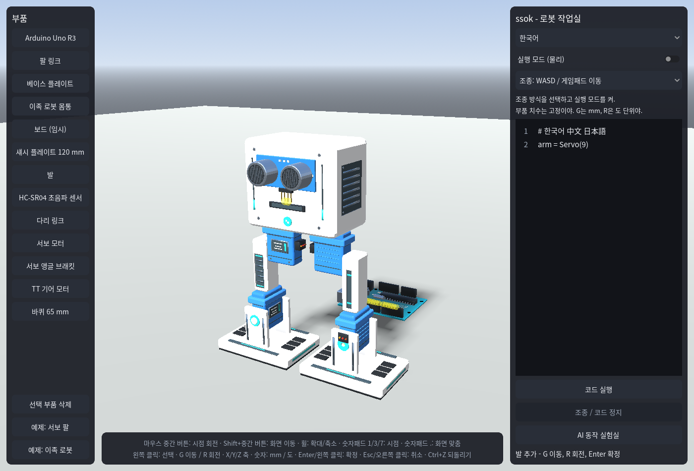
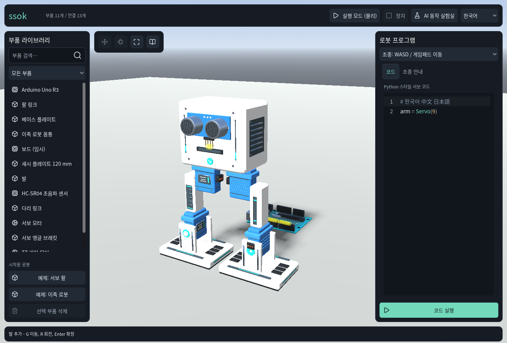
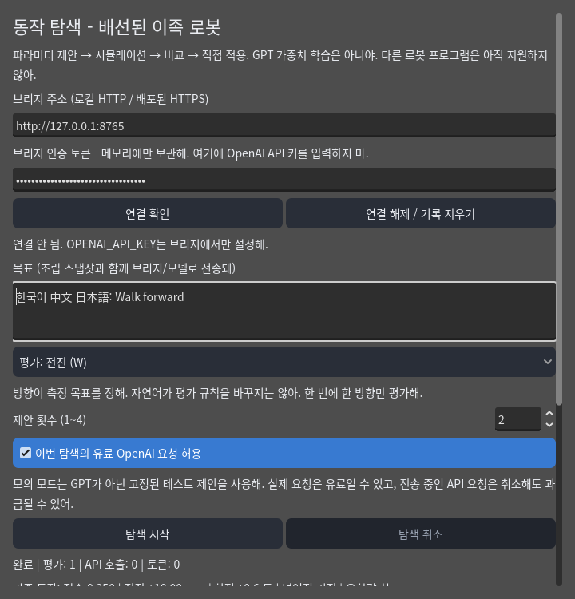
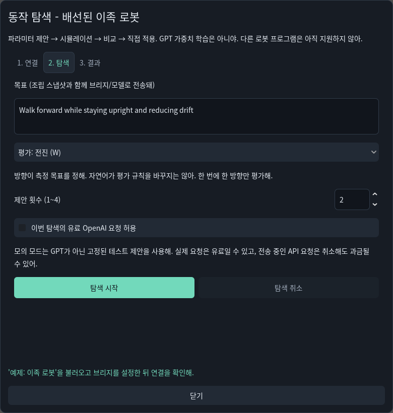
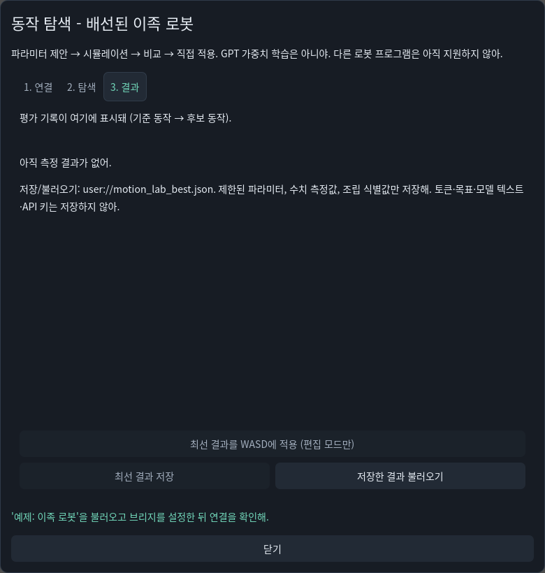

# 작업실 UI/UX 개선 — 2026-09-15

## 방향과 조사

기존 Godot 작업실을 개선한다. 웹용 랜딩 페이지로 다시 만들거나 엔진·렌더러·물리·제어권을 변경하지 않는다.
Product Design의 audit/get-context 기준으로 실제 앱 화면을 캡처하고, 정보 우선순위·첫 진입·작업 전환·안전 경고를 점검했다.
네이티브 Godot 앱이므로 브라우저 대신 실제 GL 화면을 사용했다. 새 스킬이나 임의 MCP 서버를 설치하지 않았다.

검토한 자료와 채택 판단:

| 자료 | 확인한 내용 | ssok 적용 |
|---|---|---|
| [Linear, A calmer interface (2026-03-12)](https://linear.app/now/behind-the-latest-design-refresh) | 헤더의 위치/동작 역할을 정리하고 누적된 화면 복잡도를 줄이는 방향 | 전역 실행 버튼은 상단, 작업별 도구는 해당 패널에 배치 |
| [shadcn/ui 테마](https://ui.shadcn.com/docs/theming) | 의미 기반 색상 토큰과 재사용 가능한 스타일 | 배경·텍스트·강조·경계·주요 버튼을 Godot Theme에 통합. React/CSS 런타임은 도입하지 않음 |
| [Lucide](https://lucide.dev/license) | ISC 라이선스 아이콘, 원본에 일부 Feather MIT 고지 포함 | SVG 일부를 커밋 고정하여 포함. 경로/도형은 그대로, Godot용 선 색상만 조정 |
| [Godot Dockable Container](https://github.com/gilzoide/godot-dockable-container) | Godot 4용 도킹/타일링 패널, 레이아웃 리소스 | 이번에는 미도입. 드래그 도킹과 레이아웃 저장보다 고정 작업 구조를 먼저 정리 |
| [Godot GUI skinning](https://docs.godotengine.org/en/stable/tutorials/ui/gui_skinning.html) | 네이티브 Control과 상속 가능한 테마 | 기존 SsokTheme 확장, TabContainer/ScrollContainer 사용 |

이는 전체 업계 트렌드의 정량 조사나 위 제품의 복제가 아니라, 현재 공개된 1차 자료를 참고한 ssok용 판단이다.

## 화면 점검과 개선

1. **작업실 / 부품 → 코드·조종**: 기능은 있지만 비슷한 모양의 버튼과 긴 안내가 경쟁하고, 부품 검색과 첫 시작 안내가 없었다.
   상단 도구 바, 검색·분류 라이브러리, 빈 조립 안내, 코드/조종 탭, 문법 색상, 중앙 편집 도구로 분리했다.
   언어별 검색, 필터, 상태 보존과 1152×648/1400×950 화면을 검증했다.

   
   

2. **AI 실험실 / 연결 → 탐색 → 결과**: 단일 긴 폼에서 결과·적용 버튼이 아래로 밀려났다.
   세 탭으로 나누고 상태/닫기를 공통 영역에, 적용/저장을 결과 탭 하단에 고정했다.
   비용 경고와 동의는 탐색 시작 옆에 유지한다. 취소와 로컬 기록 지우기의 차이는 그대로 명시한다.

   
   
   

## 확인 범위와 한계

- 새 UI 문구 24개를 한국어·중국어 간체·일본어에 함께 반영하고 명시적 누락 검사를 추가했다.
- 새 검색/탭은 사용자 코드·조립·목표·토큰·유료 동의를 임의 변경하지 않는다. 기존 모드 전환 규약을 유지한다.
- 작업실 검색/빈 상태/편집 도구/모드/탭, 기존 코드·WASD 제어권, AI UI의 적용 안전성 테스트를 실행한다.
- 캡처의 테스트 입력/평가 fixture는 UI 검증용이며 실제 GPT 학습 성공이나 보행 성능 증거가 아니다. 이번 작업에서 유료 API를 호출하지 않았다.
- 스크린리더, 전체 키보드 접근성, WCAG 전체 준수, 실기기 게임패드, 웹/모바일 내보내기는 이번 검증 범위가 아니다.
- 고정 패널은 1152×648 이상 데스크톱 크기를 검증했다. 작은 모바일 화면과 사용자 드래그 도킹은 후속 범위다.

```sh
godot --headless --path . --import
godot --headless --path . --quit
godot --headless --path . --language en --script tests/localization_check.gd
godot --headless --path . --language en --script tests/control_flow_check.gd
godot --headless --path . --language en --script tests/motion_lab_ui_check.gd
godot --path . --language en --script tests/workshop_ui_check.gd -- --screenshots
```

추가 캡처는 `user://uiux_previews/`에 보관한다. UI 회귀 검사는 명령에 `--headless`를 넣고 `-- --screenshots`를 빼도 실행된다.

실행 결과(2026-09-15): import/메인 로드 성공, 언어팩 headless 13,498회·GL 캡처 포함 13,506회 검사 0 실패,
작업실 headless 120회 검사 0 실패(GL 화면 흐름 64회 검사도 0 실패), 기존 제어 흐름 18회 PASS,
AI UI 36회 검사 0 실패. AI UI의 외부 mock 브리지 전송 fixture는 서버 연결 설정이 없어 실행하지 않았다.
