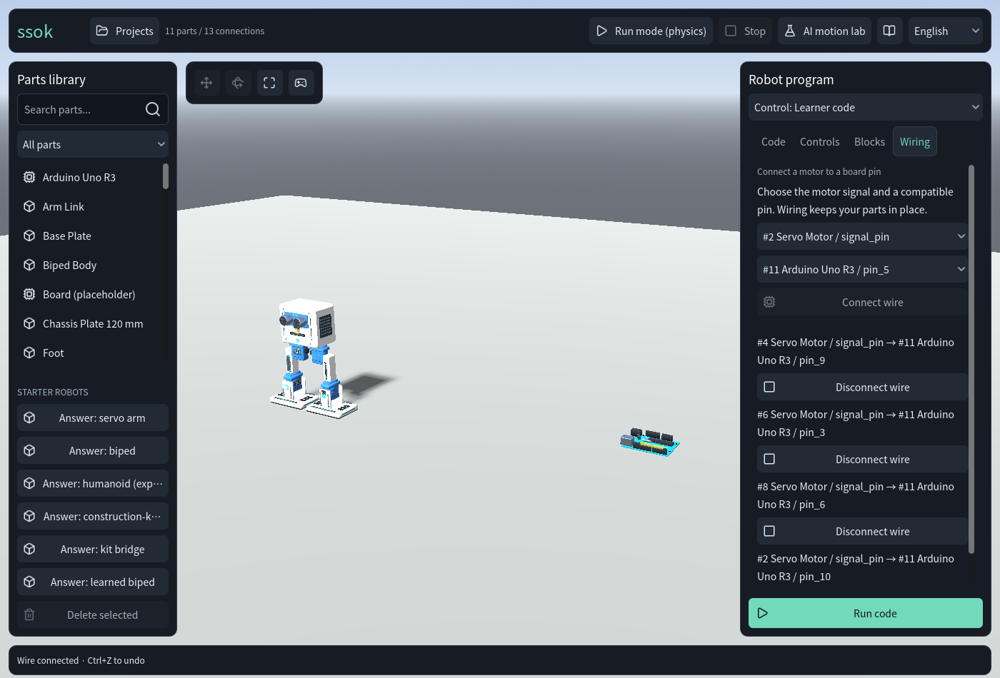
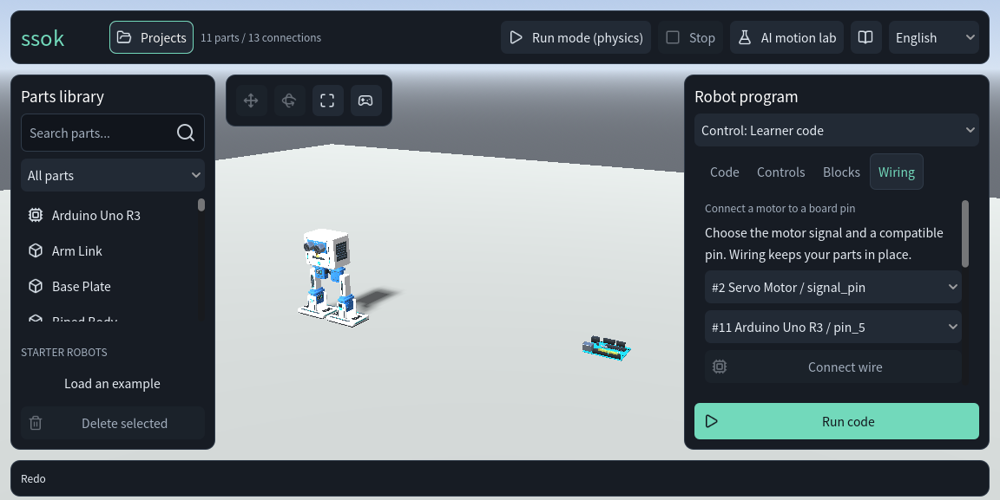
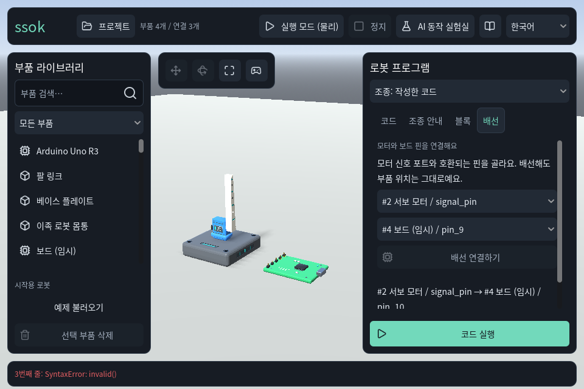
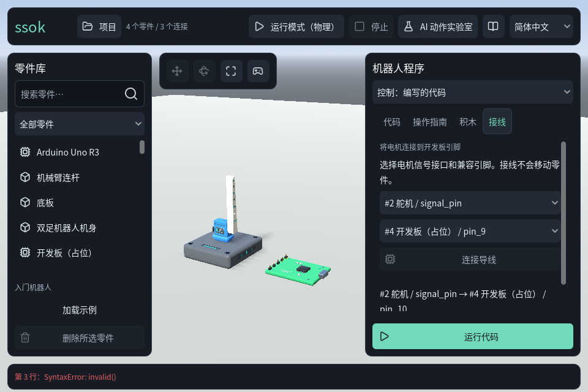
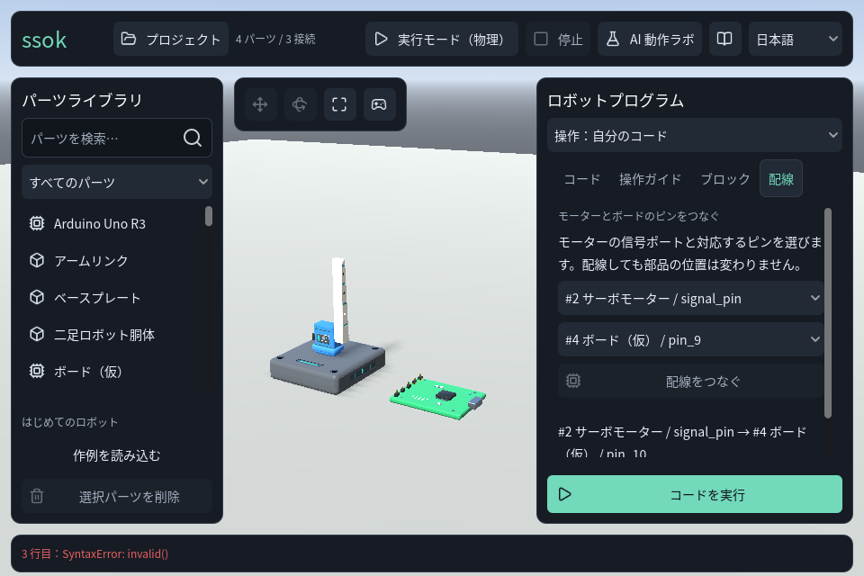

# Core authoring hardening — 30 September 2026

The owner selected assembly, coding and storage stability. This change makes the existing servo
assembly → wiring → learner program → saved project flow reliable. The next flag mission belongs
to a separate active task; locomotion research remains paused under the owner's latest direction.

## Observed problems and implemented changes

| Reproduction on the previous source | Implemented behavior |
|---|---|
| Electrical snapping moved a mounted servo by 0.094033 m. | ELEC links preserve both transforms. The Wiring tab selects real compatible ports and supports explicit disconnect/reconnect. |
| Moving a board or servo removed its signal wires. | Movement detaches mechanical links and retains wires; deletion removes all incident links. Cancel and undo restore the graph together. |
| `arm.write(70)` sent a powered 70° target before a later `invalid()` failed. | Full syntax, variable, wired-pin and numeric preflight sends no partial motor commands for a rejected program. The same reproduction leaves power off and target at zero. |
| Run used old code while an edited block draft remained visible. | Run validates and applies pending blocks. Invalid drafts and independently edited source retain both drafts. |
| The editor could create assemblies that snapshot validation rejected. | Spawn, transform and snap respect ±100 m origin bounds; the 257th part is refused. Undo and maximum-size save remain valid. |
| A focused toolbar/action button prevented assembly Undo. | Ctrl/Command+Z and redo work from non-text controls; code/text fields retain their own undo. Run and modal ownership still block graph edits. |

The wire tab owns only selection choices. ConnectionGraph remains authoritative for layout,
links, pin mapping and project snapshots. [ADR0022](../../adr/0022-electrical-links-preserve-placement.md)
explicitly supersedes ADR0002's electrical placement alignment. Mechanical alignment, physics,
actuator torque, project schema and existing angle clamps remain unchanged. The teaching language
retains its limited servo subset, with at most 2048 lines/64 KiB and 60 seconds per wait.

[Before log](core-before.log), [after log](core-after.log) and the
[reproduction driver](baseline-reproduction.gd.txt) retain actual observations. The 70° figure is
an issued motor target, not a measurement of completed physical rotation.

## Verification and exact identity

- App source: `609242be52b3519c94616a6cfd80cc71ba9e4a35`; browser test timing correction: `db602ba`.
- The initial core source `8b65791` passed [all 60 native checks](initial-full-native/verification/SUMMARY.md).
- After the history fix, [the full native run](full-native/verification/SUMMARY.md) passed **59/60**.
  The unchanged mock HTTP search fixture timed out at 120 seconds and emitted an invalid Nil call.
  The [same-source isolated import/HTTP retry](http-retry/verification/SUMMARY.md) passed **2/2**;
  the HTTP check completed in 3.1 seconds. The original failure is retained, and its cause is
  unconfirmed. This report does not relabel that full run as 60/60.
- [Four focused history/control checks](focused-history/SUMMARY.md) pass, including **54 actual
  authoring assertions** with real keyboard events, code focus and run-mode guards.
- [Release-worktree import, startup and core authoring](release-integration/SUMMARY.md) pass **3/3**.
  Hashes confirm all 31 pre-existing modified/untracked files were preserved.
- Localization: **36,900 checks, zero failures**, with 15 new messages explicitly checked in KO,
  Simplified Chinese and Japanese. EN/KO/ZH_CN/JA render at 1440×900 and 960×640. Reviewed glyphs,
  wrapping, four tab titles, pin choices and primary actions in the actual GL Compatibility view.
- [Clean Web/Linux build manifest](release.json) has `dirty_worktree:false`, pinned Godot
  `4.7.2.stable.official.ed1daf0bf`, [archive checksums](SHA256SUMS), resource audits and Linux startup.
- Chromium **153.0.8010.12** passes [Web smoke](web-smoke/result.json),
  [all nine authoring checks](web-authoring/result.json) and the
  [existing physical regression gate](web-physics/result.json) on the same exported bytes.
  Authoring uses real IndexedDB persistence, reload/open confirmation, trusted clipboard paste,
  downloaded JSON, visible block edits, pin selection and keyboard Undo/Redo. Graph transforms,
  wire edits and learner source are checked from the actual exported documents.
- Agent-browser independently loaded the earlier clean core export in Chrome154, with a rendered
  workshop canvas and no page/console errors. That initial visual probe is separate from the final
  Chromium153 app gates. [Probe details](agent-browser.json).

The first browser run left a mouse-opened pin menu unselected when Enter had no item focus.
Keyboard navigation fixed that harness defect. The subsequent browser run reproduced the real
button-focus Undo bug, which required the app fix. A read-only input trace then showed shortcut
handling occurring after the next Projects click disabled assembly; waiting for canvas frames
before reopening the modal fixed the remaining test ordering. Original failures and traces are
retained. Diagnostic prints are present only in the saved trace sources, never in the shipped app.

## Remote work, cost and remaining scope

All remote work used personal Himmel with managed detached jobs, fetched outputs and source/payload
hash comparisons. Key jobs: initial native `20260930-111010-ssok-core-full-8b65791-a3c5ea3a`,
final native `20260930-113049-ssok-core-final-609242b-0c02e9d1`, final app gates
`20260930-113139-ssok-core-browser-final-609242b-220196df`, completed authoring
`20260930-114409-ssok-core-authoring-frame-final-dbd84e7f`, and HTTP retry
`20260930-115008-ssok-core-http-retry-3f116e2a`. Completed jobs release their reservations.

**Paid model calls: 0.** Runtime dependencies, providers and billing behavior are unchanged.
The teaching subset is not full Python or real-board firmware. Wires are logical connections,
without cable geometry or tension. Chromium is the verified browser; other browser engines and
public deployment are separate checks. This completes the bounded core task, not public release
or the separately owned flag mission. Repository/PR visibility remains private/draft.
