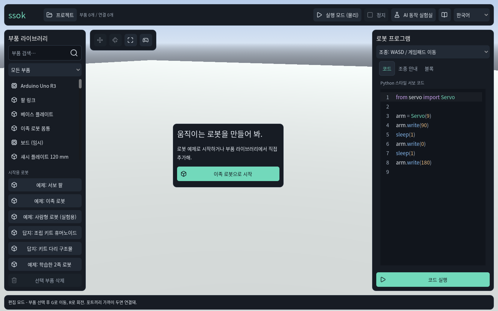
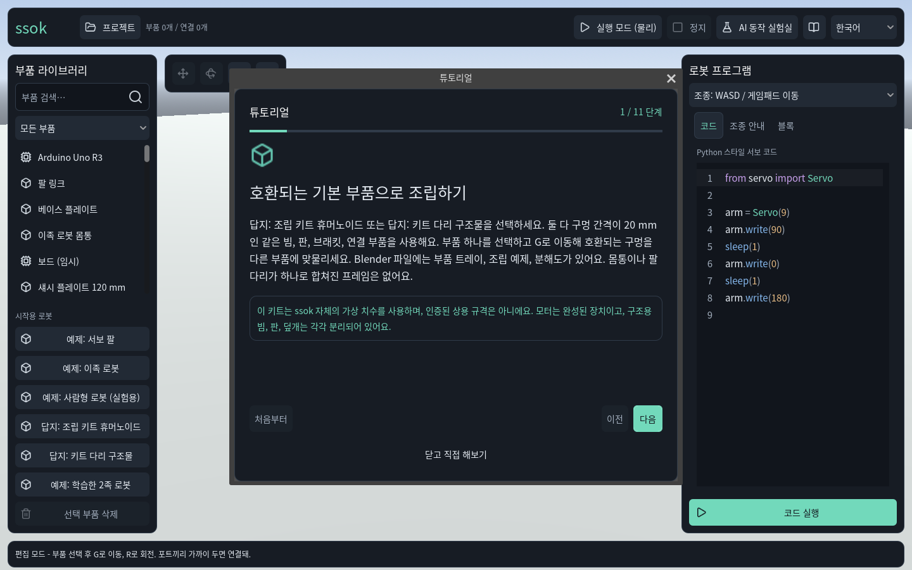
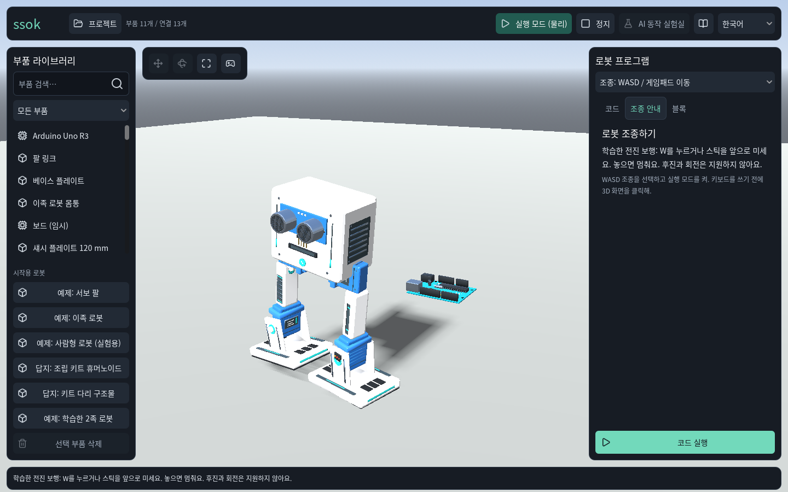
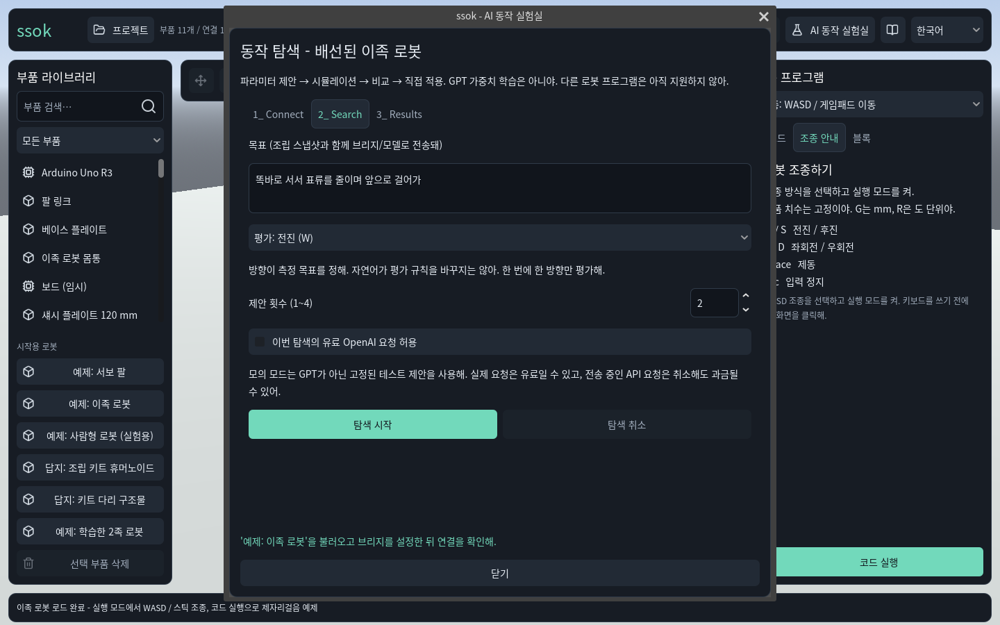

# 현재 화면 진단 (2026-09-30)

[설계·출처·AI 비용 정책 개발노트](../../PRODUCT_EXPERIENCE.md)

## 범위와 방법

로컬 Ssok 네이티브 Godot 4.7.2 GL Compatibility 앱, 한국어, 1440×900.
Git HEAD `3a142eb`, 기존 Kit 물리 WIP가 있는 작업 트리에서 캡처했다. `capture.gd`는 해당 씬의 기존 동작 핸들러를 호출하고 W 키 이벤트를 전달했다.
실제 렌더 4장을 저장하고 각각 열어 확인했다. 새 합성 UI나 예전 캡처를 근거로 쓰지 않았다.
첫 캡처 드라이버의 존재하지 않는 InputMap 이름을 기존 앱의 키 이벤트 방식으로 수정한 뒤 전부 다시 캡처했다. 아래는 최종 실행 결과다.
앱을 수동으로 처음부터 끝까지 플레이하거나 실제 사용자를 테스트한 결과는 아니다. 짧은 실행 화면을 물리 성공률 증거로 사용하지 않는다.

## 1. 첫 진입 — 목표 전달 개선 필요

- 장점: 시작 버튼과 부품 검색, 프로젝트 메뉴가 보인다. 빈 화면에서 시작하는 방법은 있다.
- 문제: 먼저 해보고 싶은 장면보다 빈 바닥·부품 목록·코드가 먼저 눈에 들어온다. 시작용 예제 6개가 비슷한 무게로 나열된다.
- 제안: 서보 팔로 깃발을 올리는 짧은 완성 장면과 행동 하나를 먼저 보여 준다. 자유 조립 경로는 접근 가능하게 둔다.
- 접근성: 작은 상태 글과 아이콘 도구의 이해 여부는 실제 초보 사용자·키보드 테스트가 필요하다. 수치 대비 검사는 하지 않았다.

## 2. 튜토리얼 — 읽기 부담 큼

- 장점: 단계 번호, 진행 표시, 닫고 직접 해보기 경로가 있다.
- 문제: 1/11에서 구멍 간격, 모델 구성, Blender 파일까지 설명한다. 배경을 막는 큰 창이어서 읽으면서 조립하기 어렵다.
- 제안: 과제의 부품 한 개와 다음 행동을 현장에서 안내한다. 기술 상세는 선택형 도움말로 옮긴다.
- 접근성: 모달 초점 순서·복귀, 작은 창에서 스크롤과 글자 확대는 이번에 검증하지 않았다.

## 3. 학습 로봇 실행 — 목적과 진행 표시 부족

- 장점: 로봇의 구체적인 부품과 모양이 보이고, 전진 전용이라는 기능 범위도 적혀 있다.
- 문제: 넓은 바닥에 목적지나 도전의 결과가 없다. 실행 중에도 부품 라이브러리와 프로그램 패널이 같은 크기로 남는다.
- 제안: 검증된 전진 기능으로 시작선과 목표선을 둔다. 현재 진행·정지·다시 하기 중심으로 화면을 정리한다.
- 접근성: 이동 화면의 멀미, 효과 줄이기, 조작 초점은 후속 실기 대상이다. 캡처 한 장은 동작 성공 인증이 아니다.

## 4. AI 탐색과 비용 안내 — 기반 있음, 설명 개선 필요

- 장점: 검색별 유료 OpenAI 요청 허용 체크와 요청 취소 후 과금 가능 문구가 실행 버튼 근처에 있다. 체크는 꺼져 있다.
- 문제: 브리지·스냅샷·측정 규칙 설명이 사용자 목표보다 두드러진다. 현재 초기 한국어 캡처에서 탭에 `1_ Connect`, `2_ Search`, `3_ Results`가 남는다. 말투도 반말/해요체가 섞인다.
- 제안: 연결 제공자/과금 방식, 보내는 정보, 요청 상한, 정책 링크를 실행 전에 읽히게 한다. 실제 UI 변경 시 네 언어 함께 검수한다.
- 접근성: 체크박스 상태·초점의 식별성은 키보드와 대비 실측 필요. 실제 유료 연결과 청구는 테스트하지 않았다.

## 검증 파일

`capture.gd`는 이번 캡처 절차, `capture.log`는 최종 실행 로그, `manifest.json`은 소스·이미지 해시와 검증 범위다.
원격 공개 링크 없이 로컬 개발노트에 보존했다.
